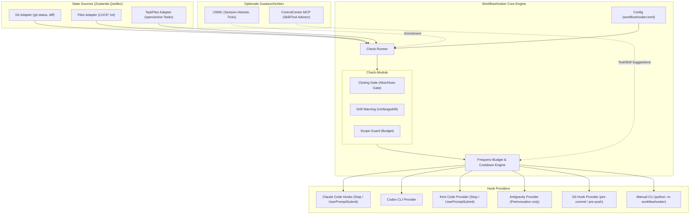
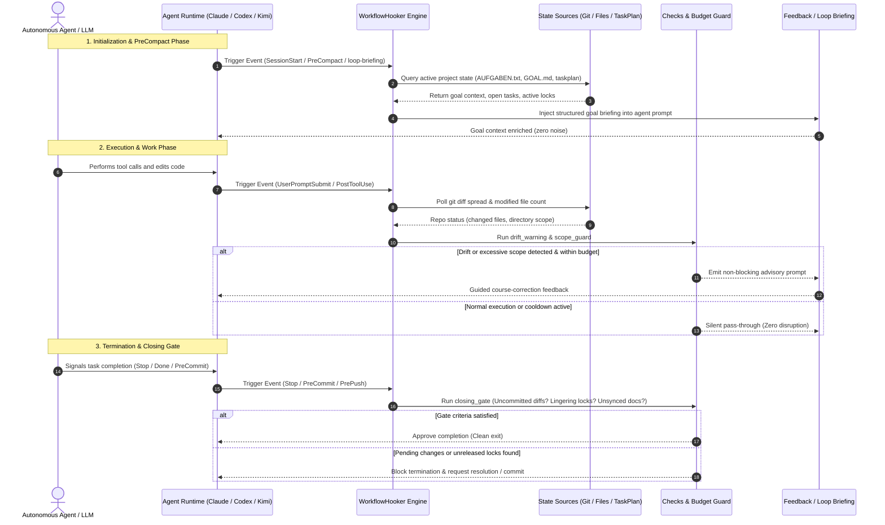

# WorkflowHooker

[](LICENSE)
[](pyproject.toml)
[](.github/workflows/ci.yml)
[](tests)
[](pyproject.toml)
[](SECURITY.md)
[](SECURITY.md)
[](https://github.com/ellmos-ai)
[](https://github.com/open-bricks)
[](ellmos-module.v2.json)
[](llms.txt)
[](README_de.md)

> [!NOTE]
> **KI/LLM-Integrationshinweis:** Dieses Repository ist nach dem `ellmos.module.v2`-Standard für autonome KI-Agenten strukturiert. Siehe [`llms.txt`](llms.txt) für maschinenlesbare Kontextdateien und [`ellmos-module.v2.json`](ellmos-module.v2.json) für das Modulmanifest.
> Deutsche Dokumentation: [`README_de.md`](README_de.md) • Sicherheitsrichtlinie: [`SECURITY.md`](SECURITY.md).

**Quick Navigation:**
[Quickstart](#install--quickstart) • [Architecture](#system-architecture) • [Workflow Lifecycle](#agent-workflow--closing-gate-lifecycle) • [Key Capabilities](#key-capabilities--safety-invariants) • [State Sources](#state-sources) • [Injectors](#target--wake-up-injectors) • [Session-Start-Hooker](#session-start-hooker-seit-030) • [Security Policy](SECURITY.md) • [Sibling Tools](#ecosystem--sibling-tools) • [LLM Context](llms.txt)

---

**Status: 0.3.0 — Autonomous Workflow Governance & Injector Engine.** (Last-checked: 2026-08-26)

Umgesetzt: `StateSource`-Protokoll, Config-Schicht (`workflowhooker.toml`,
`checks = []` per Default), read-only Adapter `git`, `files` (LOCK*.txt und
`AUFGABEN.txt`/`GOAL.md`) und optionales `taskplan` (projektbezogene offene und
aktive Tasks), drei einzeln zuschaltbare Checks (`closing_gate`,
`drift_warning`, `scope_guard`) sowie die opt-in Injektoren `goal` (PreCompact),
`loop-briefing` (lokale Weck-Runtimes) und seit 0.3.0 `policy`/`location`
(`SessionStart`, siehe [Session-Start-Hooker](#session-start-hooker-seit-030)).
Meldungsbudget + Cooldown bleiben die gemeinsame 4-Augen-Bremse. Provider
`claude`, `codex`, `kimi`, `agy` (Hook-Snippet-Generator ohne `PreToolUse` im
Default, optionale separate Blocker-Variante) + `manual` (CLI); der
`git`-Provider bleibt ein dokumentierter Stub. 177 Tests sind grün, darunter
echte Temp-Git-Repo-Fixtures.

Hooks, die den **Arbeitsablauf** eines Agenten steuern — nicht sein Wissen.

## System-Architektur



---

## Agent Workflow & Closing-Gate Lifecycle



---

## Key Capabilities & Safety Invariants

| Invariant / Capability | Guarantee | Architectural Implementation |
|---|---|---|
| **100% Local-First & Zero-Egress** | Absolute offline privacy | No network calls, telemetry, or external API pings. All state checks run purely against local files, Git repository, and process environment. |
| **Read-Only Safety by Default** | Non-mutating inspections | All check runners (`closing_gate`, `drift_warning`, `scope_guard`) and state sources perform read-only evaluations without mutating repository state. |
| **Non-Elevation / User-Mode** | Minimal privilege principle | Operates entirely in standard user space without requiring root or administrator privileges. |
| **Budgeting & Anti-Spam Guard** | Maximum 3 messages/session | Configurable message budget and cooldown intervals prevent runaway prompt flooding and context window inflation. |
| **Fail-Closed Closing Gate** | Clean work verification | Prevents premature session exits when uncommitted git diffs, dangling `LOCK*.txt` files, or unfulfilled task items remain. |
| **Target & Loop Injectors** | PreCompact & wake-up briefings | Enriches context with project goals from `AUFGABEN.txt`/`GOAL.md` and active TASKPLAN items during pre-compact and scheduled wake-up cycles. |
| **Session-Start Policy/Location Injectors** (0.3.0) | Scope-aware SessionStart context | Reads `policy-registry` scoped rules directly (no CLI subprocess) and resolves a small `source-resolver` role set (no `policy.registry` role -- see [Session-Start-Hooker](#session-start-hooker-seit-030)); both combined into ONE message so SessionStart never spends two budget slots. |
| **Boot-Context-Lint** | Opt-in contamination and sidecar drift diagnosis | Read-only scan of explicitly named Markdown/JSON files; detects dated Agy run reports, positive `GPT.md`/`CLAUDE.md`/`GEMINI.md` log targets, and `args[3]`/`prompt` drift without installing a hook. |
| **Universal Multi-Runtime Support** | Provider decoupling | Pluggable provider architecture supporting Claude Code (`Stop`, `UserPromptSubmit`, `PreCompact`, `SessionStart`), Codex CLI, Kimi Code, Antigravity (agy), and manual CLI. |
| **Zero Runtime Dependencies** | Extreme portability | Zero external Python package requirements for runtime execution (standard library only; `pytest` and `ruff` for development). |

---

## Abgrenzung zu MemoryHooker

Beide sind Hook-Module. Sie unterscheiden sich in dem, was sie einspielen:

| | MemoryHooker | WorkflowHooker |
|---|---|---|
| Spielt ein | **Wissen** (was weiß ich schon?) | **Steuerung** (arbeite ich richtig?) |
| Quelle | Memory-Backend (Gardener, USMC, …) | Regeln, Checks, Projektzustand |
| Beispiel | „Zu diesem Modul gibt es 3 Erkenntnisse" | „Du hast 40 Dateien geändert und noch keinen Test laufen lassen" |

Getrennte Module, weil sie **getrennt scheitern können**: Der eine kann sich bewähren, während der
andere sich als Gängelei erweist. Ein gemeinsames Modul würde das eine mit dem anderen begraben.

## Wofür

Zwischenchecks und Kurskorrekturen, die heute niemand stellt:

- **Verifikations-Erinnerung:** „Du erklärst gerade etwas für fertig — hast du es ausgeführt?"
- **Drift-Warnung:** Der Agent arbeitet seit N Schritten an etwas anderem als der Aufgabe.
- **Kosten-/Umfangswächter:** Ein Lauf wächst über sein Budget hinaus.

## Boot-Context-Lint (opt-in, read-only)

Der Diagnosebefehl prüft ausschließlich die explizit übergebenen Dateien und
ändert nichts:

```powershell
python -m workflowhooker boot-context-lint --format json `
  C:\Users\User\CLAUDE.md `
  C:\Users\User\.gemini\GEMINI.md `
  C:\Users\User\.gemini\config\sidecars\task-name\sidecar.json
```

Exit `0` bedeutet keine Befunde; Exit `1` bedeutet mindestens einen Befund.
Sidecar-JSON wird in beiden belegten Formen (`args[3]` oder
`schedule.args[3]`) geprüft. Explizite Verbote wie „Schreibe niemals
Laufberichte in CLAUDE.md“ sind kein positiver Writer und bleiben sauber. Der
Befehl ist kein Policy-Register, wird nicht automatisch in `SessionStart`
verdrahtet und führt keine Bereinigung aus.
- **Abschluss-Gate:** Vor dem Beenden — Steuerdateien nachgezogen? Lock entfernt? Committet?
- **Regelerinnerung:** Projektspezifische Konventionen zum richtigen Zeitpunkt statt als
  Dauer-Präambel, die im Kontext untergeht.

## Die Gefahr, die dieses Modul mitbringt

**Ein Hook, der zu oft spricht, wird ignoriert — und macht dann alles langsamer, ohne zu wirken.**
Deshalb von Anfang an:

- **Frequenz-Budget:** Ein Check, der bei jedem Schritt feuert, ist wertlos. Jeder Hook braucht eine
  Bedingung, die selten wahr ist.
- **Kein Hook ohne Erfolgsmaß.** Was soll er verhindern, und woran misst man, dass er es tat?
- **Nichts blockieren, was man nicht sicher beurteilen kann.** Ein falsch-positiver Blocker ist
  teurer als ein fehlender Check. (Empirie von diesem System: Ein Guard blockierte harmlose Skripte,
  weil sein SQL-Regex das deutsche Wort „**Alter**" für `ALTER TABLE` hielt.)

## Konstruktionsregel: das richtige Ereignis

> **`PreToolUse` nur für echte Blocker — niemals für Hinweise.**

Empirisch gemessen (2026-07-13): PreToolUse kostet **287 ms bei *jedem* Tool-Aufruf** (vorher
575 ms). Das ist für einen Schutzwall vertretbar, für einen Ratschlag nicht.

Hinweise gehören an seltene Ereignisse: `Stop`, `PreCompact`, `UserPromptSubmit`, `SessionStart` —
oder an `PostToolUse` mit enger Bedingung.

## State Sources

Wie MemoryHooker hängt auch dieses Modul hinter austauschbaren Quellen — Projektzustand kann aus
einer DB, aus Dateien oder aus einem fremden System kommen.

```python
class StateSource(Protocol):
    def snapshot(self) -> State: ...   # was ist gerade los?
```

Adapter: `taskplan` (offene Aufgaben, Locks), `git` (Diff-Umfang, uncommittete Arbeit),
`files`, `custom` per entry_point.

## Verhältnis zu USMC: eigenständig, aber importierbar (Seam)

Wie MemoryHooker bleibt dieses Modul **eigenständig** und wird von **USMC importiert**, wenn
vorhanden. Fehlt USMC, greift ein einfacherer Fallback statt eines Fehlers — dasselbe Seam-Muster,
mit dem Rinnsal schon TASKPLAN einbindet.

```
USMC vorhanden -> volle Fähigkeit: Checks kennen Sitzungshistorie, Lektionen, wiederkehrende Ticks
USMC fehlt     -> Fallback: nur zustandslose Checks (git-Diff, offene Tasks, Lock-Status)
```

**Aber Vorsicht bei der Zuordnung:** MemoryHooker gehört fachlich klar zu USMC — er liefert
**Wissen**. WorkflowHooker liefert **Steuerung**, und die ist kein Memory. Er *nutzt* USMC (für
`times_shown`, Tick-Erkennung, Sitzungsverlauf), aber er *gehört* nicht hinein. Deshalb zwei Module
und nicht eines: Sie hängen unterschiedlich stark an USMC.

**Was er aus USMC/BACH zieht, wenn verfügbar:** `memory_lessons.trigger_words` /
`trigger_events` (Lektionen, die bei Stichwörtern feuern), `times_shown` / `last_shown` (nicht
dieselbe Lektion zweimal), `memory_consolidation` (was wird überhaupt je abgerufen).

## Die Fähigkeits-Kaskade: jede Schicht schaltet mehr frei, keine ist Pflicht

```
  USMC                 importiert die Hooker      -> Schalter: Hooker an/aus
    └── Hooker         eigene Config              -> Feineinstellungen (Checks, Schwellen, Provider)
          └── ControlCenter MCP  (geplant)        -> künftige Zusatzinjektoren
```

| Vorhanden | Fähigkeit |
|---|---|
| nur WorkflowHooker | zustandslose Checks (git-Diff, offene Tasks, Lock-Status) |
| **+ USMC** | Sitzungsverlauf, `times_shown`, Erkennung wiederkehrender Ticks |
| **+ ControlCenter MCP** | geplant: passende Skills und Tools vorschlagen |

**Nichts davon ist eine harte Abhängigkeit.** Fehlt eine Schicht, fallen ihre Fähigkeiten weg —
nicht das Modul.

### Was ControlCenter freischaltet — hier liegt der Hauptnutzen

Der **ControlCenter-MCP-Server** kennt die installierten Skills, Tools, Profile und Bundles
(`controlcenter_find_skill`, `controlcenter_list_tools`, `controlcenter_suggest_bundles`). Eine
spätere Anbindung soll daraus einen Werkzeug-Ratgeber machen. In v0.1.1 wird
`[controlcenter]` nur geparst; WorkflowHooker fragt den Server noch nicht automatisch ab.

Das ist die Live-Fassung von BACHs `ToolInjector`. Dessen Begründung gilt hier wörtlich:

> *„Tools sind die Hände der LLMs — ohne Erinnerung werden sie vergessen und unnötig neu erstellt."*

**Zielbild:** BACHs Version arbeitet gegen eine gepflegte Liste. Eine spätere
ControlCenter-Anbindung soll stattdessen den tatsächlichen Installationsstand abfragen.

```toml
[controlcenter]
enabled = "auto"        # auto (nutzen wenn erreichbar) | on (Pflicht) | off
suggest_skills = true
suggest_tools  = true
warn_before_new_tool = true   # BACHs ToolInjector: warnt, bevor ein Tool neu gebaut wird,
                              # das es schon gibt
```

**Geplantes Verhalten:** `auto` soll künftig prüfen, ob der Server antwortet, und bei
Nichterreichbarkeit still schweigen. Bis zur Implementierung hat die Einstellung keine
Laufzeitwirkung.

## Modi — einstellbar, nicht fest verdrahtet

```toml
[mode]
checks = ["closing_gate"]        # jeder Check einzeln zuschaltbar, keiner per Default an
max_messages_per_session = 3     # danach schweigt das Modul — hart
cooldown_minutes = 5             # Vorbild: BACHs Injektor-Cooldowns (1-3 min)

[providers]
order = ["claude", "codex", "git", "manual"]   # erster verfuegbarer gewinnt
```

**Provider-Fallback wie bei MemoryHooker:** Nicht jeder Agent hat dieselben Hooks. `git` ist der
universelle Fallback — Git-Hooks funktionieren überall, unabhängig vom Agenten, und feuern an
Arbeits**grenzen** (`pre-commit`, `pre-push`). Für ein Abschluss-Gate ist das sogar der *natürlichere*
Ort als ein Agenten-Hook.

## Verhältnis zu BACH — die konkrete Vorlage

BACH hat **sieben Injektoren** (`python bach.py inject --help`). **Fünf davon sind Steuerung und
gehören hierher:**

| BACH-Injektor | Was er tut |
|---|---|
| **`StrategyInjector`** | Triggerwort → hilfreicher Gedanke. „Fehler" → *„Fehler sind wichtige Informationen"*; „komplex" → *„in kleine Schritte zerlegen"*; „blockiert" → *„überspringen und später zurückkommen"* |
| **`ToolInjector`** | Erinnert an vorhandene Tools. Begründung im Docstring: *„Tools sind die Hände der LLMs — ohne Erinnerung werden sie vergessen und unnötig neu erstellt."* |
| **`BetweenInjector`** | Between-Task-Erinnerung nach `done` — erkennt Session-Ende und schweigt dann |
| **`MetaFeedbackInjector`** | Erkennt **wiederkehrende LLM-Ticks** und injiziert Korrektur-Feedback. **Auto-Deaktivierung, wenn das Muster nicht mehr auftritt** |
| **`TimeInjector`** | Timebeat + ungelesene Nachrichten |

(`ContextInjector` und Teile von `ReminderInjector` gehören dagegen zu **MemoryHooker** — sie liefern
Wissen, keine Steuerung.)

**Drei Mechanismen sind übernehmenswert, weil sie das Spam-Problem lösen:**

1. **Cooldowns** (BACH: 1–3 min je Injektor) — verhindert Dauerfeuer.
2. **Auto-Deaktivierung** (`MetaFeedbackInjector`) — ein Check, der nichts mehr findet, **schaltet
   sich selbst ab**. Das ist die eleganteste Antwort auf „ab wann nervt es".
3. **`usage_count`** — BACH zählt, welcher Trigger je gefeuert hat. Wer nie feuert, kann weg.

**Nicht übernommen** wird die Orchestrierungs-Maschinerie *innerhalb* der Fachmodule — sie bleibt in
der Hook-Schicht.

## Install & Quickstart

1. `pip install -e ".[dev]"` im Repo-Klon (zero-dependency zur Laufzeit;
   `pytest` nur fuer die Testsuite).
2. `workflowhooker.toml` anlegen und **explizit** die gewuenschten Checks
   eintragen (`[mode] checks = ["closing_gate"]`) — ohne Datei bleibt das
   Modul komplett stumm, das ist Absicht (README: "keiner ist per Default
   an").
3. Manuell testen: `python -m workflowhooker check` (liest Projektordner +
   Git-Status des aktuellen Arbeitsverzeichnisses, sofern `--project-dir`
   nicht gesetzt ist).
4. Claude-Code-Hook einrichten (bleibt bewusst ein manueller Schritt):
   `python -m workflowhooker install-snippet --out snippet.json` erzeugt den
   `Stop`/`PreCompact`/`UserPromptSubmit`-Block, der von Hand in
   `~/.claude/settings.json` unter `"hooks"` eingemischt wird. Enthaelt
   niemals `PreToolUse` — die optionale Blocker-Variante
   (`ClaudeProvider.pretooluse_blocker_snippet()`) ist bewusst eine
   getrennte, nicht automatisch eingebundene Methode.
5. Für Codex erzeugt `python -m workflowhooker install-snippet --provider codex --out
   snippet.json` einen Block für `~/.codex/hooks.json`. Codex muss ihn anschließend
   interaktiv über `/hooks` freigeben.

## Kandidaten-Sammler fuer Skill-/Workflow-Extraktion (opt-in)

Trennt bewusst den LEICHTEN Live-Hook vom TEUREN Extraktionsschritt
(`TODO.md`, Punkt 2). Zwei getrennte Kommandos:

- **`python -m workflowhooker candidate-collect <Stop|SessionEnd> --provider
  <name>`** — der Live-Hook. Liest dasselbe stdin-JSON wie `hook-run` und
  schreibt hoechstens EIN redigiertes Envelope pro Sitzung in die
  Warteschlange (`<state-dir>/candidates.jsonl`): `provider`, `event`,
  `session_ref`, `source_anchor` (nur der `transcript_path`-ZEIGER aus dem
  stdin-JSON, falls vorhanden — niemals Transkriptinhalt), ein paar billige
  `observed`-Zaehler und `redaction = "pointer-only"`. Kein stdout, keine
  `hookSpecificOutput`-Injektion — der Agent bekommt davon nichts zu sehen.
  **Stumm per Default:** ohne `[candidates] enabled = true` in der Config
  ist der Befehl ein No-Op (kein State-Ordner, keine Datei), selbst wenn der
  Hook versehentlich verdrahtet ist. **Idempotent:** ein mehrfach feuernder
  Hook (z. B. mehrere Stop-Events in derselben Sitzung) reiht trotzdem nur
  einmal ein. **Fail-open:** I/O-Fehler beim Schreiben werden verschluckt,
  der Hook bricht nie ab.
- **`python -m workflowhooker candidate-extract [--format plain|json]
  [--clear]`** — der OFFLINE-Schritt. Rein lesend: listet die Warteschlange
  auf und verweist auf die Skills, die die eigentliche (teure, semantische)
  Ableitung ausfuehren — **`skill-extractor`** (Chatverlauf →
  wiederverwendbarer Skill) bzw. **`workflow-extract`** (Chatverlauf/
  Automations-Prompt → Cron-/Loop-Automatisierung). Dieser Befehl fuehrt
  selbst KEINE Extraktion aus.

**Aktivierung bleibt manuell und opt-in, pro Akteur:**

```toml
[candidates]
enabled = true       # Default: false -- stumm, bis explizit zugestimmt
max_records = 500    # bounded queue -- aeltere Eintraege fallen zuerst raus
```

Wie bei `hook-run` gibt es **kein** automatisches Eintragen in eine echte
`settings.json`/`hooks.json` — jeder Akteur verdrahtet
`candidate-collect Stop --provider <name>` (bzw. `SessionEnd`, falls der
Akteur dieses Event kennt) selbst in seinem eigenen Hook-System, analog zu
den `hook-run`-Beispielen oben.

## Target & Wake-Up Injectors

Die Injektoren bleiben standardmäßig stumm und werden ausdrücklich in
`workflowhooker.toml` aktiviert:

```toml
[injectors]
goal = true       # Ziel/Tasks beim PreCompact-Hook injizieren
loop = true       # loop-briefing als lokale Runtime-Schnittstelle freigeben
```

Der `PreCompact`-Hook liest das Projektziel aus `AUFGABEN.txt` oder `GOAL.md`
und ergänzt projektbezogene offene/aktive TASKPLAN-Tasks. Ein optionaler
Taskplan-Ausfall bleibt still. Für lokale Modelle liefert
`python -m workflowhooker loop-briefing --project-dir .` ein deterministisches
Briefing aus Ziel, offenen Tasks, Locks und uncommitteter Arbeit; der Taktgeber
(Cron, Scheduled Task oder Runtime-Loop) bleibt außerhalb von WorkflowHooker.
Mit `--format json` ist die Ausgabe maschinenlesbar.

## Session-Start-Hooker (seit 0.3.0)

`SessionStart` ist seit 0.3.0 ein vollwertiges `hook-run`-Event
(zuvor nur als Zielbild in diesem README beschrieben, siehe Ticket
`T-20260825-185089693`). Zwei weitere Injektoren sind ausdrücklich
opt-in, wie alle anderen:

```toml
[injectors]
policy = true     # Projektbezogene policy-registry-Regeln beim SessionStart
location = true   # Bekannte Orte per source-resolver-Rolle beim SessionStart

[injectors.policy_config]
registry_path = ""   # leer = Default ~/.policy-registry/registry.json
max_entries = 5       # Obergrenze pro Nachricht -- kein zweites CLAUDE.md

[injectors.location_config]
roles = ["resources.inventory", "decisions.ledger", "user.model", "memory.curated"]
```

- **`PolicyInjector`** liest `~/.policy-registry/registry.json` direkt
  (kein `import policy_registry`, kein CLI-Subprozess -- siehe
  `workflowhooker/scope_match.py` Moduldocstring: das Paket ist nicht
  pip-installiert, und dessen CLI-Adapter braucht bis zu 15s pro Aufruf,
  unzumutbar fuer SessionStart). Die Session-Projektzugehoerigkeit wird
  aus dem Pfad abgeleitet (`.TOPICS\<pipeline>\...`-Segmente bzw. der
  Plan-D-Repo-Name unter `...\repos\<name>`, siehe
  `candidate_scopes_from_path`) -- kein Katalog-I/O, eine bewusste
  Vereinfachung. Nur projekt-/pipeline-spezifische Regeln werden gezeigt
  (`exact`/`wildcard`/`parent`-Relation); global-scope-Regeln (`system-wide`)
  werden **nicht** wiederholt, weil sie bereits im redundant-statischen
  Kern von CLAUDE.md stehen (siehe Abschnitt "Sicherheits-/
  Faktentreue-Kernsätze bleiben statisch" unten).
- **`LocationInjector`** löst eine kleine, konfigurierbare Rollenliste über
  `source_resolver.resolve(rolle)` auf (lazy import, fail-open wie
  `sources/taskplan.py`) -- statt Pfade in Prosa hart zu kodieren, die
  bei einem Modulumzug sofort veraltet wären. Die Rolle `policy.registry`
  ist im Default-Set bewusst ausgeschlossen: ihr `source-resolver`-Adapter
  ruft dieselbe langsame CLI auf, die `PolicyInjector` gerade umgeht.
- **Ein kombiniertes Budget:** Policy- und Ortsinjektor werden bei
  SessionStart zu **einer** Nachricht zusammengefasst
  (`_build_session_start_message` in `cli.py`) -- zwei separate Injektoren
  würden sonst zwei von `mode.max_messages_per_session` verbrauchen und
  den Rest der Sitzung stumm schalten.

### Sicherheits-/Faktentreue-Kernsätze bleiben statisch (Entscheidung H3=A)

Wenn Regelinhalt aus `CLAUDE.md` in dynamische Träger wandert (wie oben),
bleiben sicherheits- und integritätsnahe Kernsätze (z. B. "keine
Zugangsdaten in USMC/Gardener", der Faktentreue-Kernsatz, harte
Sprachregeln) **zusätzlich wortwörtlich redundant in CLAUDE.md** stehen --
sie werden nicht durch `PolicyInjector` ersetzt. Begründung: ein
Registry-/Resolver-Ausfall darf bei einer Sicherheitsregel niemals
stillschweigend "Regel fehlt in dieser Session" bedeuten -- dasselbe
Fail-closed-Prinzip, das dieses System durchgängig für Register-Ausfälle
anwendet (`unknown` statt `clear`/leer). Die Kosten sind minimal (wenige,
kurze Sätze). Entschieden 2026-08-25 (`D-20260825-009`, Option A);
verankert zusätzlich in Ticket `T-20260825-860165488`, das die bestehende
Wiederherstellungs-Kette der Agenten-Regeldateien (`agents-bridge`,
`T-20260822-901323804`) referenziert -- diese Kette transportiert die
statischen Kernsätze byte-treu und hash-verifiziert zwischen Hosts;
`PolicyInjector`/`LocationInjector` sind eine ergänzende, dynamische
Schicht darüber, kein Ersatz.

## Was noch nicht umgesetzt ist

- **`git`-Provider**: keine echte Git-Hook-Installation (`pre-commit`,
  `pre-push`); bleibt Stub bis ROADMAP v0.2+.
- **Codex-Laufzeitfreigabe**: Provider und Snippet sind implementiert und direkt getestet; die
  jeweilige Codex-Installation muss `~/.codex/hooks.json` dennoch interaktiv über `/hooks`
  freigeben.
- **agy-Abschluss-Gate**: Fuer Antigravity ist nur `PreInvocation` ->
  `UserPromptSubmit` verdrahtet (analog `memoryhooker/providers/agy.py`,
  [G 2026-07-25]). Ein Sitzungsende- oder Vor-Kompaktierungs-Event ist fuer
  agy NICHT dokumentiert, daher hat `closing_gate` dort KEINE native
  Bindung -- dokumentierte Luecke, kein geratener Ersatz.
- **`drift_warning`**: reine Proxy-Heuristik (Streuung ueber Top-Level-
  Ordner) — versteht die eigentliche Aufgabe nicht und kann das laut README
  auch nicht (Ermessensfrage).
- **`scope_guard`**: warnt nur bei Dateizahl-Schwelle, NICHT bei fehlendem
  Testlauf — ob Tests liefen, ist ohne CI-Anbindung nicht zuverlaessig
  feststellbar (Faktentreue: kein geratener Fakt im Meldungstext).
- **Verifikations-Erinnerung** und **Regelerinnerung zum passenden
  Zeitpunkt** (ROADMAP v0.2): noch nicht gebaute Checks.
- **Custom-Adapter per entry_point** (ROADMAP v0.3): noch nicht gebaut.
- **Automatisches Eintragen des `claude`-Hook-Snippets** in eine echte
  `settings.json` (bleibt bewusst manuell).
- **Scheduler/Taktgeber:** WorkflowHooker erzeugt nur das Loop-Briefing; die
  lokale Runtime oder ein geplanter Prozess ruft es auf.

## Ecosystem & Sibling Tools

WorkflowHooker is part of the `ellmos-ai` autonomous agent infrastructure and the broader `open-bricks` open-source umbrella:

| Tool / Repository | Category | Role & Purpose |
|---|---|---|
| **[WorkflowHooker](https://github.com/ellmos-ai/workflowhooker)** | `ellmos-ai` / Orchestration | Agent process governance, closing gates, drift alerts & wake-up loop injectors |
| **[MemoryHooker](https://github.com/ellmos-ai/memoryhooker)** | `ellmos-ai` / Context | Persistent memory injection and knowledge retrieval for AI agent sessions |
| **[system-explorer](https://github.com/ellmos-ai/system-explorer)** | `ellmos-ai` / Diagnostics | Multi-agent system discovery, topology inspection & runtime receipt handling |
| **[policy-registry](https://github.com/ellmos-ai/policy-registry)** | `ellmos-ai` / Governance | Declarative access control, schema validation & security policy enforcement |
| **[ellmos-delegation-authority](https://github.com/ellmos-ai/ellmos-delegation-authority)** | `ellmos-ai` / Delegation | Multi-agent token-based authority & capability delegation framework |
| **[sqlite-transit-sync](https://github.com/ellmos-ai/sqlite-transit-sync)** | `ellmos-ai` / Storage | High-reliability SQLite transactional state replication across host nodes |
| **[lock-master](https://github.com/ellmos-ai/lock-master)** | `ellmos-ai` / Concurrency | Zero-dependency file locking, resource mutexes & contested claim resolution |
| **[system-gap-master](https://github.com/ellmos-ai/system-gap-master)** | `ellmos-ai` / Sync | Distributed multi-host synchronization, gatekeeper & conflict copy reconciler |
| **[open-compute-mcp](https://github.com/ellmos-ai/open-compute-mcp)** | `ellmos-ai` / Automation | Open Compute MCP server for desktop OS automation and operator ceilings |
| **[ellmos-filecommander-mcp](https://github.com/ellmos-ai/ellmos-filecommander-mcp)** | `ellmos-ai` / MCP | High-performance filesystem and process management MCP server (47 tools) |
| **[ellmos-codecommander-mcp](https://github.com/ellmos-ai/ellmos-codecommander-mcp)** | `ellmos-ai` / MCP | AST code analysis, refactoring, and linting MCP server |
| **[ellmos-controlcenter-mcp](https://github.com/ellmos-ai/ellmos-controlcenter-mcp)** | `ellmos-ai` / MCP | MCP stack control plane, bundle suggestor & semantic skill router |
| **[n8n-manager-mcp](https://github.com/ellmos-ai/n8n-manager-mcp)** | `ellmos-ai` / Workflow | Safe n8n workflow management, node inspection and deployment MCP tool |
| **[automation-master](https://github.com/dev-bricks/automation-master)** | `dev-bricks` / Automation | Multi-agent task queue, lease coordinator and lock orchestration |
| **[DevCenter](https://github.com/dev-bricks/DevCenter)** | `dev-bricks` / Workspace | Unified local developer workbench and workspace orchestrator |
| **[CodeBox](https://github.com/dev-bricks/CodeBox)** | `dev-bricks` / Development | Sandboxed code evaluation, plugin runtime and devtool playground |
| **[MethodenAnalyser](https://github.com/dev-bricks/MethodenAnalyser)** | `dev-bricks` / Analysis | Automated method parsing, cyclomatic complexity & cognitive metrics |
| **[open-bricks](https://github.com/open-bricks)** | `open-bricks` / Umbrella | Open architecture suite connecting tools, desktops, and agent systems |

## Lizenz

MIT License — Copyright (c) 2026 ellmos-ai
