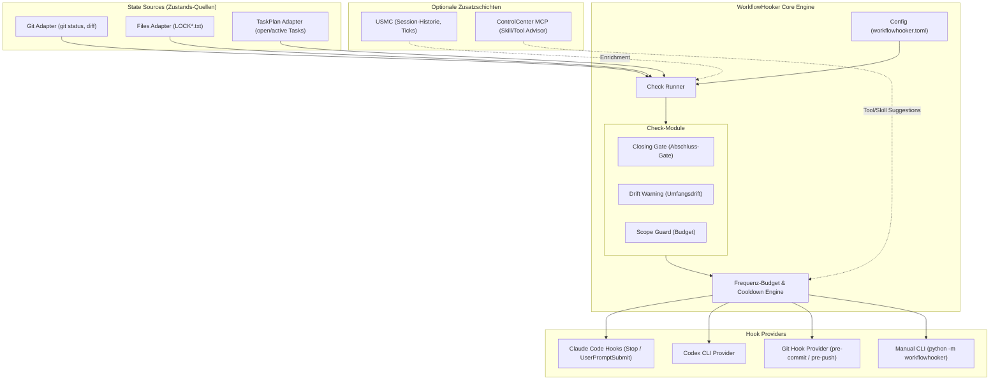

# WorkflowHooker

[](LICENSE)
[](pyproject.toml)
[](tests)
[](https://github.com/ellmos-ai)
[](https://github.com/open-bricks)
[](ellmos-module.v2.json)
[](llms.txt)
[](README_de.md)

> [!NOTE]
> **KI/LLM-Integrationshinweis:** Dieses Repository ist nach dem `ellmos.module.v2`-Standard für autonome KI-Agenten strukturiert. Siehe [`llms.txt`](llms.txt) für maschinenlesbare Kontextdateien und [`ellmos-module.v2.json`](ellmos-module.v2.json) für das Modulmanifest.
> Deutsche Dokumentation: [`README_de.md`](README_de.md).

**Status: 0.2.1 — Arbeitsablaufsteuerung & Injektormuster.** (Last-checked: 2026-08-14)

Umgesetzt: `StateSource`-Protokoll, Config-Schicht (`workflowhooker.toml`,
`checks = []` per Default), read-only Adapter `git`, `files` (LOCK*.txt und
`AUFGABEN.txt`/`GOAL.md`) und optionales `taskplan` (projektbezogene offene und
aktive Tasks), drei einzeln zuschaltbare Checks (`closing_gate`,
`drift_warning`, `scope_guard`) sowie die opt-in Injektoren `goal` (PreCompact)
und `loop-briefing` (lokale Weck-Runtimes). Meldungsbudget + Cooldown bleiben
die gemeinsame 4-Augen-Bremse. Provider `claude`, `codex`, `kimi`
(Hook-Snippet-Generator ohne `PreToolUse` im Default, optionale separate
Blocker-Variante) + `manual` (CLI); der `git`-Provider bleibt ein
dokumentierter Stub. 97 Tests sind grün, darunter echte Temp-Git-Repo-Fixtures.

Hooks, die den **Arbeitsablauf** eines Agenten steuern — nicht sein Wissen.

## Systemarchitektur



## Abgrenzung zu MemoryHooker

Beide sind Hook-Module. Sie unterscheiden sich in dem, was sie einspielen:

| | MemoryHooker | WorkflowHooker |
|---|---|---|
| Spielt ein | **Wissen** (was weiß ich schon?) | **Steuerung** (arbeite ich richtig?) |
| Quelle | Memory-Backend (Gardener, USMC, …) | Regeln, Checks, Projektzustand |
| Beispiel | „Zu diesem Modul gibt es 3 Erkenntnisse" | „Du hast 40 Dateien geändert und noch keinen Test laufen lassen" |

Getrennte Module, weil sie **getrennt scheitern können**: Der eine kann sich bewähren, während der
andere sich als Gängelei erweist. Ein gemeinsames Modul würde das eine mit dem anderen begraben.

## Wofür

Zwischenchecks und Kurskorrekturen, die heute niemand stellt:

- **Verifikations-Erinnerung:** „Du erklärst gerade etwas für fertig — hast du es ausgeführt?"
- **Drift-Warnung:** Der Agent arbeitet seit N Schritten an etwas anderem als der Aufgabe.
- **Kosten-/Umfangswächter:** Ein Lauf wächst über sein Budget hinaus.
- **Abschluss-Gate:** Vor dem Beenden — Steuerdateien nachgezogen? Lock entfernt? Committet?
- **Regelerinnerung:** Projektspezifische Konventionen zum richtigen Zeitpunkt statt als
  Dauer-Präambel, die im Kontext untergeht.

## Die Gefahr, die dieses Modul mitbringt

**Ein Hook, der zu oft spricht, wird ignoriert — und macht dann alles langsamer, ohne zu wirken.**
Deshalb von Anfang an:

- **Frequenz-Budget:** Ein Check, der bei jedem Schritt feuert, ist wertlos. Jeder Hook braucht eine
  Bedingung, die selten wahr ist.
- **Kein Hook ohne Erfolgsmaß.** Was soll er verhindern, und woran misst man, dass er es tat?
- **Nichts blockieren, was man nicht sicher beurteilen kann.** Ein falsch-positiver Blocker ist
  teurer als ein fehlender Check. (Empirie von diesem System: Ein Guard blockierte harmlose Skripte,
  weil sein SQL-Regex das deutsche Wort „**Alter**" für `ALTER TABLE` hielt.)

## Konstruktionsregel: das richtige Ereignis

> **`PreToolUse` nur für echte Blocker — niemals für Hinweise.**

Empirisch gemessen (2026-07-13): PreToolUse kostet **287 ms bei *jedem* Tool-Aufruf** (vorher
575 ms). Das ist für einen Schutzwall vertretbar, für einen Ratschlag nicht.

Hinweise gehören an seltene Ereignisse: `Stop`, `PreCompact`, `UserPromptSubmit`, `SessionStart` —
oder an `PostToolUse` mit enger Bedingung.

## Nutzerneutral

Wie MemoryHooker hängt auch dieses Modul hinter austauschbaren Quellen — Projektzustand kann aus
einer DB, aus Dateien oder aus einem fremden System kommen.

```python
class StateSource(Protocol):
    def snapshot(self) -> State: ...   # was ist gerade los?
```

Geplante Adapter: `taskplan` (offene Aufgaben, Locks), `git` (Diff-Umfang, uncommittete Arbeit),
`files`, `custom` per entry_point.

## Verhältnis zu USMC: eigenständig, aber importierbar (Seam)

Wie MemoryHooker bleibt dieses Modul **eigenständig** und wird von **USMC importiert**, wenn
vorhanden. Fehlt USMC, greift ein einfacherer Fallback statt eines Fehlers — dasselbe Seam-Muster,
mit dem Rinnsal schon TASKPLAN einbindet.

```
USMC vorhanden -> volle Fähigkeit: Checks kennen Sitzungshistorie, Lektionen, wiederkehrende Ticks
USMC fehlt     -> Fallback: nur zustandslose Checks (git-Diff, offene Tasks, Lock-Status)
```

**Aber Vorsicht bei der Zuordnung:** MemoryHooker gehört fachlich klar zu USMC — er liefert
**Wissen**. WorkflowHooker liefert **Steuerung**, und die ist kein Memory. Er *nutzt* USMC (für
`times_shown`, Tick-Erkennung, Sitzungsverlauf), aber er *gehört* nicht hinein. Deshalb zwei Module
und nicht eines: Sie hängen unterschiedlich stark an USMC.

**Was er aus USMC/BACH zieht, wenn verfügbar:** `memory_lessons.trigger_words` /
`trigger_events` (Lektionen, die bei Stichwörtern feuern), `times_shown` / `last_shown` (nicht
dieselbe Lektion zweimal), `memory_consolidation` (was wird überhaupt je abgerufen).

## Die Fähigkeits-Kaskade: jede Schicht schaltet mehr frei, keine ist Pflicht

```
  USMC                 importiert die Hooker      -> Schalter: Hooker an/aus
    └── Hooker         eigene Config              -> Feineinstellungen (Checks, Schwellen, Provider)
          └── ControlCenter MCP  (geplant)        -> künftige Zusatzinjektoren
```

| Vorhanden | Fähigkeit |
|---|---|
| nur WorkflowHooker | zustandslose Checks (git-Diff, offene Tasks, Lock-Status) |
| **+ USMC** | Sitzungsverlauf, `times_shown`, Erkennung wiederkehrender Ticks |
| **+ ControlCenter MCP** | geplant: passende Skills und Tools vorschlagen |

**Nichts davon ist eine harte Abhängigkeit.** Fehlt eine Schicht, fallen ihre Fähigkeiten weg —
nicht das Modul.

### Was ControlCenter freischaltet — hier liegt der Hauptnutzen

Der **ControlCenter-MCP-Server** kennt die installierten Skills, Tools, Profile und Bundles
(`controlcenter_find_skill`, `controlcenter_list_tools`, `controlcenter_suggest_bundles`). Eine
spätere Anbindung soll daraus einen Werkzeug-Ratgeber machen. In v0.1.1 wird
`[controlcenter]` nur geparst; WorkflowHooker fragt den Server noch nicht automatisch ab.

Das ist die Live-Fassung von BACHs `ToolInjector`. Dessen Begründung gilt hier wörtlich:

> *„Tools sind die Hände der LLMs — ohne Erinnerung werden sie vergessen und unnötig neu erstellt."*

**Zielbild:** BACHs Version arbeitet gegen eine gepflegte Liste. Eine spätere
ControlCenter-Anbindung soll stattdessen den tatsächlichen Installationsstand abfragen.

```toml
[controlcenter]
enabled = "auto"        # auto (nutzen wenn erreichbar) | on (Pflicht) | off
suggest_skills = true
suggest_tools  = true
warn_before_new_tool = true   # BACHs ToolInjector: warnt, bevor ein Tool neu gebaut wird,
                              # das es schon gibt
```

**Geplantes Verhalten:** `auto` soll künftig prüfen, ob der Server antwortet, und bei
Nichterreichbarkeit still schweigen. Bis zur Implementierung hat die Einstellung keine
Laufzeitwirkung.

## Modi — einstellbar, nicht fest verdrahtet

```toml
[mode]
checks = ["closing_gate"]        # jeder Check einzeln zuschaltbar, keiner per Default an
max_messages_per_session = 3     # danach schweigt das Modul — hart
cooldown_minutes = 5             # Vorbild: BACHs Injektor-Cooldowns (1-3 min)

[providers]
order = ["claude", "codex", "git", "manual"]   # erster verfuegbarer gewinnt
```

**Provider-Fallback wie bei MemoryHooker:** Nicht jeder Agent hat dieselben Hooks. `git` ist der
universelle Fallback — Git-Hooks funktionieren überall, unabhängig vom Agenten, und feuern an
Arbeits**grenzen** (`pre-commit`, `pre-push`). Für ein Abschluss-Gate ist das sogar der *natürlichere*
Ort als ein Agenten-Hook.

## Verhältnis zu BACH — die konkrete Vorlage

BACH hat **sieben Injektoren** (`python bach.py inject --help`). **Fünf davon sind Steuerung und
gehören hierher:**

| BACH-Injektor | Was er tut |
|---|---|
| **`StrategyInjector`** | Triggerwort → hilfreicher Gedanke. „Fehler" → *„Fehler sind wichtige Informationen"*; „komplex" → *„in kleine Schritte zerlegen"*; „blockiert" → *„überspringen und später zurückkommen"* |
| **`ToolInjector`** | Erinnert an vorhandene Tools. Begründung im Docstring: *„Tools sind die Hände der LLMs — ohne Erinnerung werden sie vergessen und unnötig neu erstellt."* |
| **`BetweenInjector`** | Between-Task-Erinnerung nach `done` — erkennt Session-Ende und schweigt dann |
| **`MetaFeedbackInjector`** | Erkennt **wiederkehrende LLM-Ticks** und injiziert Korrektur-Feedback. **Auto-Deaktivierung, wenn das Muster nicht mehr auftritt** |
| **`TimeInjector`** | Timebeat + ungelesene Nachrichten |

(`ContextInjector` und Teile von `ReminderInjector` gehören dagegen zu **MemoryHooker** — sie liefern
Wissen, keine Steuerung.)

**Drei Mechanismen sind übernehmenswert, weil sie das Spam-Problem lösen:**

1. **Cooldowns** (BACH: 1–3 min je Injektor) — verhindert Dauerfeuer.
2. **Auto-Deaktivierung** (`MetaFeedbackInjector`) — ein Check, der nichts mehr findet, **schaltet
   sich selbst ab**. Das ist die eleganteste Antwort auf „ab wann nervt es".
3. **`usage_count`** — BACH zählt, welcher Trigger je gefeuert hat. Wer nie feuert, kann weg.

**Nicht übernommen** wird die Orchestrierungs-Maschinerie *innerhalb* der Fachmodule — sie bleibt in
der Hook-Schicht.

## Install

1. `pip install -e ".[dev]"` im Repo-Klon (zero-dependency zur Laufzeit;
   `pytest` nur fuer die Testsuite).
2. `workflowhooker.toml` anlegen und **explizit** die gewuenschten Checks
   eintragen (`[mode] checks = ["closing_gate"]`) — ohne Datei bleibt das
   Modul komplett stumm, das ist Absicht (README: "keiner ist per Default
   an").
3. Manuell testen: `python -m workflowhooker check` (liest Projektordner +
   Git-Status des aktuellen Arbeitsverzeichnisses, sofern `--project-dir`
   nicht gesetzt ist).
4. Claude-Code-Hook einrichten (bleibt bewusst ein manueller Schritt):
   `python -m workflowhooker install-snippet --out snippet.json` erzeugt den
   `Stop`/`PreCompact`/`UserPromptSubmit`-Block, der von Hand in
   `~/.claude/settings.json` unter `"hooks"` eingemischt wird. Enthaelt
   niemals `PreToolUse` — die optionale Blocker-Variante
   (`ClaudeProvider.pretooluse_blocker_snippet()`) ist bewusst eine
   getrennte, nicht automatisch eingebundene Methode.
5. Für Codex erzeugt `python -m workflowhooker install-snippet --provider codex --out
   snippet.json` einen Block für `~/.codex/hooks.json`. Codex muss ihn anschließend
   interaktiv über `/hooks` freigeben.

## Ziel- und Weck-Injektoren

Die Injektoren bleiben standardmäßig stumm und werden ausdrücklich in
`workflowhooker.toml` aktiviert:

```toml
[injectors]
goal = true       # Ziel/Tasks beim PreCompact-Hook injizieren
loop = true       # loop-briefing als lokale Runtime-Schnittstelle freigeben
```

Der `PreCompact`-Hook liest das Projektziel aus `AUFGABEN.txt` oder `GOAL.md`
und ergänzt projektbezogene offene/aktive TASKPLAN-Tasks. Ein optionaler
Taskplan-Ausfall bleibt still. Für lokale Modelle liefert
`python -m workflowhooker loop-briefing --project-dir .` ein deterministisches
Briefing aus Ziel, offenen Tasks, Locks und uncommitteter Arbeit; der Taktgeber
(Cron, Scheduled Task oder Runtime-Loop) bleibt außerhalb von WorkflowHooker.
Mit `--format json` ist die Ausgabe maschinenlesbar.

## Was noch nicht umgesetzt ist

- **`git`-Provider**: keine echte Git-Hook-Installation (`pre-commit`,
  `pre-push`); bleibt Stub bis ROADMAP v0.2+.
- **Codex-Laufzeitfreigabe**: Provider und Snippet sind implementiert und direkt getestet; die
  jeweilige Codex-Installation muss `~/.codex/hooks.json` dennoch interaktiv über `/hooks`
  freigeben.
- **`drift_warning`**: reine Proxy-Heuristik (Streuung ueber Top-Level-
  Ordner) — versteht die eigentliche Aufgabe nicht und kann das laut README
  auch nicht (Ermessensfrage).
- **`scope_guard`**: warnt nur bei Dateizahl-Schwelle, NICHT bei fehlendem
  Testlauf — ob Tests liefen, ist ohne CI-Anbindung nicht zuverlaessig
  feststellbar (Faktentreue: kein geratener Fakt im Meldungstext).
- **Verifikations-Erinnerung** und **Regelerinnerung zum passenden
  Zeitpunkt** (ROADMAP v0.2): noch nicht gebaute Checks.
- **Custom-Adapter per entry_point** (ROADMAP v0.3): noch nicht gebaut.
- **Automatisches Eintragen des `claude`-Hook-Snippets** in eine echte
   `settings.json` (bleibt bewusst manuell).
- **Scheduler/Taktgeber:** WorkflowHooker erzeugt nur das Loop-Briefing; die
  lokale Runtime oder ein geplanter Prozess ruft es auf.

## Lizenz

MIT
