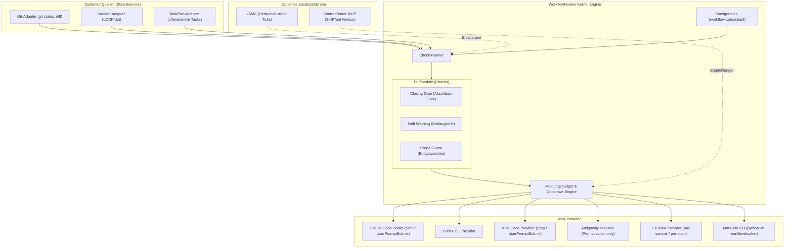
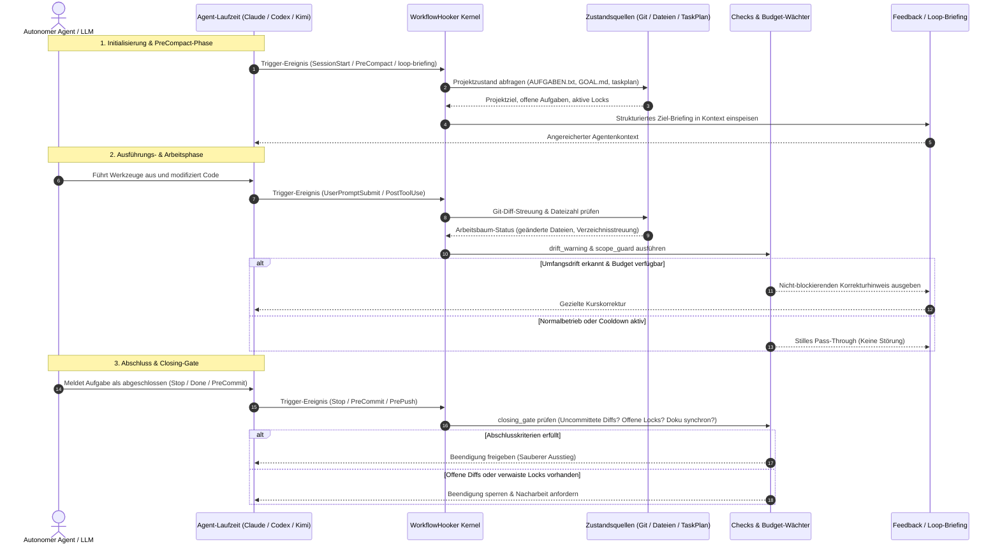

# WorkflowHooker (Deutsche Dokumentation)

[](LICENSE)
[](pyproject.toml)
[](.github/workflows/ci.yml)
[](tests)
[](pyproject.toml)
[](SECURITY.md)
[](SECURITY.md)
[](https://github.com/ellmos-ai)
[](https://github.com/open-bricks)
[](ellmos-module.v2.json)
[](llms.txt)
[](README.md)

> [!NOTE]
> **KI/LLM-Integrationshinweis:** Dieses Repository ist nach dem `ellmos.module.v2`-Standard für autonome KI-Agenten strukturiert. Siehe [`llms.txt`](llms.txt) für maschinenlesbare Kontextdateien und [`ellmos-module.v2.json`](ellmos-module.v2.json) für das Modulmanifest.
> Englische Haupt-Dokumentation: [`README.md`](README.md) • Sicherheitsrichtlinie: [`SECURITY.md`](SECURITY.md).

**Schnellnavigation:**
[Schnellstart](#schnellstart--installation) • [Architektur](#systemarchitektur) • [Workflow-Lebenszyklus](#agenten-workflow--closing-gate-lebenszyklus) • [Kernfähigkeiten](#kernfähigkeiten--sicherheitsinvarianten) • [Injektoren](#ziel--und-weck-injektoren) • [Session-Start-Hooker](#session-start-hooker-seit-030) • [Sicherheitsrichtlinie](SECURITY.md) • [Geschwisterwerkzeuge](#ökosystem--geschwisterwerkzeuge) • [LLM-Kontext](llms.txt)

---

**Status: 0.3.0 — Arbeitsablaufsteuerung & Injektormuster.** (Last-checked: 2026-08-29)

WorkflowHooker bietet Hooks, die den **Arbeitsablauf** autonomer KI-Agenten steuern — nicht deren Wissen.

---

## Systemarchitektur



---

## Agenten-Workflow & Closing-Gate-Lebenszyklus



---

## Kernfähigkeiten & Sicherheitsinvarianten

| Invariante / Fähigkeit | Garantie | Technische Umsetzung |
|---|---|---|
| **100% Local-First & Zero-Egress** | Vollständiger Offline-Datenschutz | Keine Netzwerkaufrufe, keine Telemetrie, keine externen API-Zugriffe. Alle Prüfungen erfolgen rein auf lokalen Dateien, Git und Prozessumgebung. |
| **Standardmäßig rein lesend** | Nebenwirkungsfreie Prüfungen | Alle Check-Runner (`closing_gate`, `drift_warning`, `scope_guard`) und Zustandsadapter arbeiten strikt im Nur-Lese-Modus ohne Repository-Mutation. |
| **Unprivilegierter User-Mode** | Non-Elevation Prinzip | Funktioniert vollständig im Standard-Benutzerkonto ohne Root- oder Administrator-Rechte. |
| **Meldungsbudget & Anti-Spam** | Max. 3 Meldungen / Session | Konfigurierbare Meldungsobergrenzen und Cooldown-Timer verhindern Kontextüberlastung und Prompt-Dauerfeuer. |
| **Deterministisches Closing-Gate** | Verlässliche Arbeitsabnahme | Verhindert vorzeitige Beendigung bei uncommitteten Diffs, verwaisten `LOCK*.txt`-Sperren oder offenen Aufgaben. |
| **Ziel- & Loop-Injektoren** | PreCompact & Weck-Briefings | Speist Projektziele aus `AUFGABEN.txt`/`GOAL.md` und TASKPLAN-Tasks bei PreCompact und periodischen Weckzyklen in den Agentenkontext ein. |
| **Policy-/Ortsinjektor** (0.3.0) | Scope-bewusster SessionStart-Kontext | Liest `policy-registry`-Regeln direkt (kein CLI-Subprozess) und loest eine kleine `source-resolver`-Rollenliste auf; beides zu EINER Nachricht kombiniert (siehe [Session-Start-Hooker](#session-start-hooker-seit-030)). |
| **Boot-Context-Lint** | Opt-in Diagnose für Kontamination und Sidecar-Drift | Rein lesende Prüfung explizit benannter Markdown-/JSON-Dateien; erkennt datierte Agy-Laufberichte, positive Logziele in `GPT.md`/`CLAUDE.md`/`GEMINI.md` und Drift zwischen `args[3]` und `prompt`, ohne einen Hook zu installieren. |
| **Laufzeitunabhängige Provider** | Plattformunabhängige Hooks | Modulare Provider-Architektur für Claude Code (`Stop`, `UserPromptSubmit`, `PreCompact`, `SessionStart`), Codex CLI, Kimi Code und manuelle CLI. |
| **Zero Runtime Dependencies** | Maximale Portabilität | Keine externen Python-Laufzeitabhängigkeiten (reine Standardbibliothek; `pytest` und `ruff` nur für Entwicklung). |

---

## Abgrenzung zu MemoryHooker

| | MemoryHooker | WorkflowHooker |
|---|---|---|
| Spielt ein | **Wissen** (was weiß ich schon?) | **Steuerung** (arbeite ich richtig?) |
| Quelle | Memory-Backend (Gardener, USMC, …) | Regeln, Checks, Projektzustand |
| Beispiel | „Zu diesem Modul gibt es 3 Erkenntnisse" | „Du hast 40 Dateien geändert und noch keinen Test laufen lassen" |

---

## Kernfunktionen

- **Abschluss-Gate (`closing_gate`):** Prüft vor dem Beenden, ob Steuerdateien nachgezogen, Locks entfernt und Diffs committet sind.
- **Drift-Warnung (`drift_warning`):** Warnt, wenn sich ein Agent über viele Ordner verzweigt oder vom Ziel abweicht.
- **Scope Guard (`scope_guard`):** Schutz vor unkontrollierten Großänderungen ohne Zwischenverifikation.
- **Frequenz-Budget & Cooldown:** Verhindert Spam-Feedback. Ein Hook spricht nur, wenn eine seltene Regel verletzt wird.
- **Auto-Deaktivierung:** Checks deaktivieren sich selbst, wenn das Fehlermuster nicht mehr auftritt (MetaFeedbackInjector-Muster).

---

## Schnellstart & Installation

### Boot-Context-Lint (opt-in, rein lesend)

```powershell
python -m workflowhooker boot-context-lint --format json `
  C:\Users\User\CLAUDE.md `
  C:\Users\User\.gemini\GEMINI.md `
  C:\Users\User\.gemini\config\sidecars\task-name\sidecar.json
```

Exit `0` bedeutet keine Befunde; Exit `1` bedeutet mindestens einen Befund.
Der Lint versteht top-level `args[3]` und `schedule.args[3]`, behandelt klare
Verbotsformulierungen nicht als positiven Writer und verändert keine Datei.
Er ist keine Regelautorität und wird nicht automatisch an `SessionStart`
gebunden.

1. `pip install -e ".[dev]"` im Repo-Klon (zero-dependency zur Laufzeit; `pytest` nur für die Testsuite).
2. `workflowhooker.toml` anlegen und **explizit** die gewünschten Checks eintragen (`[mode] checks = ["closing_gate"]`).
3. Manuell ausführen: `python -m workflowhooker check` (prüft Projektordner + Git-Status des Arbeitsverzeichnisses).
4. Claude-Code-Hook generieren: `python -m workflowhooker install-snippet --out snippet.json` erzeugt den `Stop`/`PreCompact`/`UserPromptSubmit`-Block.
5. Codex-Hook generieren: `python -m workflowhooker install-snippet --provider codex --out snippet.json`.

---

## Kandidaten-Job- und Receipt-Vertrag (opt-in)

`candidate-collect` bleibt ein leichter, stummer Lifecycle-Hook und startet
kein Modell. `GoalComplete` plant den primären Job, `SessionEnd` nur einen noch
nicht abgedeckten Resthorizont, `PreCompact` schreibt ausschließlich einen
Checkpoint, `SessionStart` validiert und recovered intakte abgelaufene Leases
derselben Sitzung, während verwaiste Job-Receipts auf `failed` gehen, und
`Stop` prüft nur die Eligibility. Unveränderliche Jobs liegen unter
`<state-dir>/candidates/jobs/`, atomar ersetzte Receipts unter
`<state-dir>/candidates/receipts/`; die alte `candidates.jsonl` bleibt nur
lesbar. Der vollständige Idempotenzschlüssel umfasst Provider, Session,
Goal/Boundary, Horizont, Extractorversion und Privacyklasse.

Receipts unterscheiden `pending`, `leased`, `noop`, `candidate`, `promoted`,
`failed` und `deferred`, einschließlich Versuchszahl, Lease-Ende, Lease-Owner,
Fehlerklasse, Kandidaten-IDs und Budget-Reservierungszeitpunkt. Externe
Session-IDs werden für den Vertrag opak gehasht, unabhängig von der
Dateinamens-Normalisierung. Budgetprüfung und Reservierung sind gemeinsam
prozessübergreifend exklusiv. `candidate` benötigt mindestens eine
Kandidaten-ID; nur die unveränderten geprüften IDs dürfen anschließend nach
`promoted` wechseln. `candidate` bleibt bis zur Review aktiv; nur `noop`,
`promoted` und `failed` sind terminal und danach unveränderlich.
Ein vorhandener beschädigter Zustand wird
nicht still zurückgesetzt. Im Spool liegt kein Transkriptinhalt; freie
`observed`-Textfelder werden verworfen, gespeichert werden nur der lokale
Pfadzeiger, dessen Hash, die inhaltsfreien Byte-Grenzen des freigegebenen
Fensters und erlaubte Zähler. Ein später angehängter Sessionabschnitt wird
dadurch nicht versehentlich mitgelesen. Ein lokaler Window-Hash bindet
Pfad-Hash, Start, Ende und Horizont gegen nachträgliche Offset-Änderungen.
Zusätzlich wird beim Job ein SHA-256-Hash über genau diese Bytes gebildet, ohne
Inhalt im Spool zu speichern. Dadurch scheitern auch gleich lange
In-place-Ersetzungen vor dem Runner. Historische S1-Jobs ohne diese Bindung
müssen für S2 neu eingereiht werden.
Existierende relative Quellen werden schon beim Enqueue absolut aufgelöst;
nicht auflösbare relative Anker werden verworfen und können nach einem
`cwd`-Wechsel nicht auf eine andere Datei zeigen.

`ExtractorConsumer` ist die explizite lokale S2-Bibliotheksoberfläche. Ihr
injizierter Runner erhält einen Auftrag, der zwingend die kanonischen Skills
`workflow-extract` und `skill-extractor` lädt; WorkflowHooker dupliziert deren
semantische Regeln nicht. Vor dem Aufruf werden Fenster-, Token- und
Privacygrenzen geprüft, Secrets und PII einschließlich strukturierter
Secret-Felder redigiert und lokale Hash-/Ereignisanker gebildet. Der
vollständige serialisierte Auftrag wird konservativ gegen das
Job-Tokenbudget begrenzt; der Runner muss dieselbe Obergrenze mit seinem
modellspezifischen Tokenizer für Ein- und Ausgabe durchsetzen. Zulässig sind
nur `noop`, `lesson`, `skill_update_candidate` und `workflow_candidate`.
Der Runner muss die tatsächlich geladenen Skill-Versionen/-Hashes und seine
Ein-/Ausgabe-Tokens quittieren; falsche Receipts oder Budgetüberschreitungen
scheitern geschlossen. Ein Timeout gibt die Lease erst frei, nachdem der
Runner zurückgekehrt ist oder sich selbst hart beendet hat; es bleibt kein
weiterarbeitender Consumer-Thread zurück. Kandidaten werden unveränderlich unter
`<state-dir>/candidates/staged/` abgelegt, bleiben reviewpflichtig und dürfen
nicht direkt promoviert werden. Es gibt weiterhin keine automatische Providerregistrierung,
USMC-Promotion oder kanonische Skilländerung.

`candidate-extract` listet Jobs und Receipts weiterhin rein lesend. Die
veraltete Option `--clear` bleibt
read-only und entfernt weder die alte JSONL-Kompatibilitätsdatei noch v2-Jobs.
Retention wartet auf Budget- sowie gebänderte Session-/Receipt-Locks und
schützt Tages-/Session-Budgetbelege bis zu einem persistenten Session-End-Marker.
Dieser Marker wird auch bei einem mit `GoalComplete` überlappenden `SessionEnd`
geschrieben, das keinen zweiten Job erzeugt. Beide Lockklassen sind auf jeweils
256 Stripe-Dateien begrenzt und werden konkurrenzsicher initialisiert. Scheitert
unter Windows die Joblöschung, stellt die
Retention ein bereits entferntes Receipt wieder her. Receipt-Leser verwenden
denselben Stripe-Lock; blockiert ein fremder Windows-Leser dennoch den
atomaren Replace, bleibt der unveränderte Zustand sicher retry-fähig.
Aktivierung und Providerregistrierung bleiben manuell.

Die vollständige Konfiguration mit Job-, Sitzungs-, Tages- und Lease-Budgets
steht in `README.md`, Abschnitt „Kandidaten-Job- und Receipt-Vertrag“.

---

## Ziel- und Weck-Injektoren

In `workflowhooker.toml` aktivieren:

```toml
[injectors]
goal = true       # Ziel/Tasks beim PreCompact-Hook injizieren
loop = true       # loop-briefing als lokale Runtime-Schnittstelle freigeben
```

Für lokale Modelle liefert `python -m workflowhooker loop-briefing --project-dir .` ein deterministisches Briefing aus Ziel, offenen Tasks, Locks und uncommitteter Arbeit.

---

## Session-Start-Hooker (seit 0.3.0)

`SessionStart` ist seit 0.3.0 ein vollwertiges `hook-run`-Event. Zwei weitere Injektoren sind ausdrücklich opt-in:

```toml
[injectors]
policy = true     # Projektbezogene policy-registry-Regeln beim SessionStart
location = true   # Bekannte Orte per source-resolver-Rolle beim SessionStart
```

`PolicyInjector` liest `~/.policy-registry/registry.json` **direkt** (kein `import policy_registry`, kein CLI-Subprozess — das Paket ist nicht installiert und dessen CLI-Adapter braucht bis zu 15s pro Aufruf). Die Projektzugehörigkeit wird ohne Katalog-I/O aus dem Pfad abgeleitet; nur projekt-/pipeline-spezifische Regeln werden gezeigt, globale Regeln (`system-wide`) **nicht** — die stehen bereits im redundant-statischen Kern von CLAUDE.md (siehe unten). `LocationInjector` löst eine kleine Rollenliste über `source_resolver.resolve()` auf, lazy und fail-open, ohne die langsame `policy.registry`-Rolle. Beide Injektoren werden bei SessionStart zu **einer** Nachricht zusammengefasst, damit zwei Injektoren nicht zwei von `mode.max_messages_per_session` verbrauchen.

**Sicherheits-/Faktentreue-Kernsätze bleiben statisch (Entscheidung H3=A):** Sicherheits- und integritätsnahe Kernsätze in CLAUDE.md (z. B. Zugangsdaten-Regeln, Faktentreue-Kernsatz, Sprachregeln) werden **nicht** durch `PolicyInjector` ersetzt, sondern bleiben zusätzlich wortwörtlich in CLAUDE.md stehen — ein Registry-Ausfall darf bei einer Sicherheitsregel nie stillschweigend „Regel fehlt" bedeuten (Fail-closed, dasselbe Prinzip wie überall sonst in diesem System). Entschieden 2026-08-25 (`D-20260825-009`, Option A); verankert in Ticket `T-20260825-860165488`, das auf die bestehende Wiederherstellungs-Kette der Agenten-Regeldateien (`agents-bridge`, `T-20260822-901323804`) verweist — diese Kette transportiert die statischen Kernsätze byte-treu zwischen Hosts, die Injektoren hier sind eine ergänzende dynamische Schicht darüber, kein Ersatz.

---

## Ökosystem & Geschwisterwerkzeuge

WorkflowHooker ist Teil der `ellmos-ai`-Infrastruktur und des `open-bricks`-Ökosystems:

| Werkzeug / Repository | Kategorie | Rolle & Zweck |
|---|---|---|
| **[WorkflowHooker](https://github.com/ellmos-ai/workflowhooker)** | `ellmos-ai` / Orchestrierung | Agenten-Prozesssteuerung, Abschluss-Gates, Drift-Warnungen & Weck-Injektoren |
| **[MemoryHooker](https://github.com/ellmos-ai/memoryhooker)** | `ellmos-ai` / Kontext | Persistente Wissensinjektion und Kontextanreicherung für KI-Sitzungen |
| **[system-explorer](https://github.com/ellmos-ai/system-explorer)** | `ellmos-ai` / Diagnose | Multi-Agenten-Systeminspektion, Topologieanalyse & Runtime-Quittungen |
| **[policy-registry](https://github.com/ellmos-ai/policy-registry)** | `ellmos-ai` / Governance | Deklarative Zugriffskontrolle, Schemavalidierung & Sicherheitsrichtlinien |
| **[ellmos-delegation-authority](https://github.com/ellmos-ai/ellmos-delegation-authority)** | `ellmos-ai` / Delegation | Multi-Agenten-Token-Autorität & fähigkeitsbasierte Delegation |
| **[sqlite-transit-sync](https://github.com/ellmos-ai/sqlite-transit-sync)** | `ellmos-ai` / Speicherung | Transaktionale SQLite-Zustandsreplikation über Host-Knoten |
| **[lock-master](https://github.com/ellmos-ai/lock-master)** | `ellmos-ai` / Nebenläufigkeit | Zero-Dependency Dateisperren, Mutexe & Konfliktauflösung |
| **[system-gap-master](https://github.com/ellmos-ai/system-gap-master)** | `ellmos-ai` / Synchronisation | Verteilte Multi-Host-Synchronisation & Konfliktkopien-Bereinigung |
| **[open-compute-mcp](https://github.com/ellmos-ai/open-compute-mcp)** | `ellmos-ai` / Automatisierung | Open Compute MCP-Server für Desktop-Betriebssystem-Automatisierung |
| **[ellmos-filecommander-mcp](https://github.com/ellmos-ai/ellmos-filecommander-mcp)** | `ellmos-ai` / MCP | Hochperformante Dateisystem- und Prozessverwaltungs-Werkzeuge (47 Tools) |
| **[ellmos-codecommander-mcp](https://github.com/ellmos-ai/ellmos-codecommander-mcp)** | `ellmos-ai` / MCP | Code-Analyse, AST-Refactoring und Python-Linter MCP-Server |
| **[ellmos-controlcenter-mcp](https://github.com/ellmos-ai/ellmos-controlcenter-mcp)** | `ellmos-ai` / MCP | MCP-Steuerungsebene, Bundle-Vorschläge & semantischer Skill-Router |
| **[n8n-manager-mcp](https://github.com/ellmos-ai/n8n-manager-mcp)** | `ellmos-ai` / Workflow | Sichere n8n-Workflow-Verwaltung, Node-Inspektion und Deployment |
| **[automation-master](https://github.com/dev-bricks/automation-master)** | `dev-bricks` / Automatisierung | Multi-Agenten-Aufgabenwarteschlange, Lease-Koordinator & Sperrorchestrierung |
| **[DevCenter](https://github.com/dev-bricks/DevCenter)** | `dev-bricks` / Entwickler | Einheitliche lokale Entwickler-Werkbank und Workspace-Orchestrierung |
| **[CodeBox](https://github.com/dev-bricks/CodeBox)** | `dev-bricks` / Entwicklung | Isolierte Code-Ausführung, Plugin-Laufzeit und Entwicklungs-Sandbox |
| **[MethodenAnalyser](https://github.com/dev-bricks/MethodenAnalyser)** | `dev-bricks` / Analyse | Automatisierte Methoden-Analyse, zyklomatische Komplexität & Metriken |
| **[open-bricks](https://github.com/open-bricks)** | `open-bricks` / Dachverband | Offene Architektur für Werkzeuge, Desktop-Software und KI-Agenten |

---

## Lizenz

MIT License — Copyright (c) 2026 ellmos-ai
