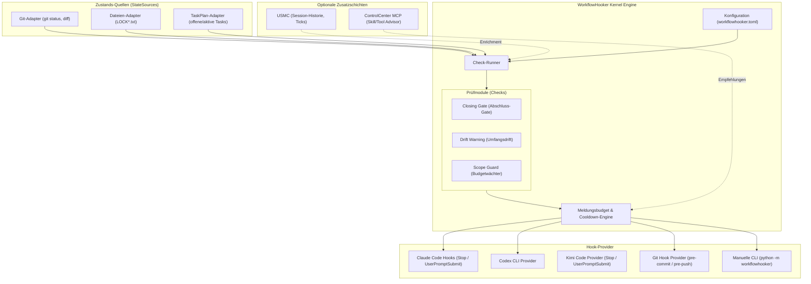

# WorkflowHooker (Deutsche Dokumentation)

[](LICENSE)
[](pyproject.toml)
[](tests)
[](https://github.com/ellmos-ai)
[](https://github.com/open-bricks)
[](ellmos-module.v2.json)
[](llms.txt)
[](README.md)

> [!NOTE]
> **KI/LLM-Integrationshinweis:** Dieses Repository ist nach dem `ellmos.module.v2`-Standard für autonome KI-Agenten strukturiert. Siehe [`llms.txt`](llms.txt) für maschinenlesbare Kontextdateien und [`ellmos-module.v2.json`](ellmos-module.v2.json) für das Modulmanifest.
> Englische Haupt-Dokumentation: [`README.md`](README.md).

**Status: 0.2.1 — Arbeitsablaufsteuerung & Injektormuster.** (Last-checked: 2026-08-08)

WorkflowHooker bietet Hooks, die den **Arbeitsablauf** autonomer KI-Agenten steuern — nicht deren Wissen.

---

## Systemarchitektur



---

## Abgrenzung zu MemoryHooker

| | MemoryHooker | WorkflowHooker |
|---|---|---|
| Spielt ein | **Wissen** (was weiß ich schon?) | **Steuerung** (arbeite ich richtig?) |
| Quelle | Memory-Backend (Gardener, USMC, …) | Regeln, Checks, Projektzustand |
| Beispiel | „Zu diesem Modul gibt es 3 Erkenntnisse" | „Du hast 40 Dateien geändert und noch keinen Test laufen lassen" |

---

## Kernfunktionen

- **Abschluss-Gate (`closing_gate`):** Prüft vor dem Beenden, ob Steuerdateien nachgezogen, Locks entfernt und Diffs committet sind.
- **Drift-Warnung (`drift_warning`):** Warnt, wenn sich ein Agent über viele Ordner verzweigt oder vom Ziel abweicht.
- **Scope Guard (`scope_guard`):** Schutz vor unkontrollierten Großänderungen ohne Zwischenverifikation.
- **Frequenz-Budget & Cooldown:** Verhindert Spam-Feedback. Ein Hook spricht nur, wenn eine seltene Regel verletzt wird.
- **Auto-Deaktivierung:** Checks deaktivieren sich selbst, wenn das Fehlermuster nicht mehr auftritt (MetaFeedbackInjector-Muster).

---

## Schnellstart & Installation

```bash
# 1. Paket im Development-Modus installieren
pip install -e ".[dev]"

# 2. workflowhooker.toml Konfiguration erstellen
# Standardmäßig sind alle Checks deaktiviert ([mode] checks = ["closing_gate"])

# 3. CLI-Prüfung manuell testen
python -m workflowhooker check

# 4. Tests ausführen
python -m pytest
```

## Ziel- und Weck-Injektoren

Die Injektoren sind opt-in:

```toml
[injectors]
goal = true       # Ziel/Tasks beim PreCompact-Hook
loop = true       # lokales Weck-Briefing
```

`goal` liest `AUFGABEN.txt` oder `GOAL.md` sowie projektbezogene offene und
aktive TASKPLAN-Tasks. `python -m workflowhooker loop-briefing --project-dir .`
erzeugt für lokale Runtimes ein deterministisches Briefing aus Ziel, Tasks,
Locks und uncommitteter Arbeit. WorkflowHooker stellt keinen Scheduler; den
Takt übernimmt Cron, eine Scheduled Task oder die Runtime.

---

## Lizenz

MIT License — Copyright (c) 2026 ellmos-ai
