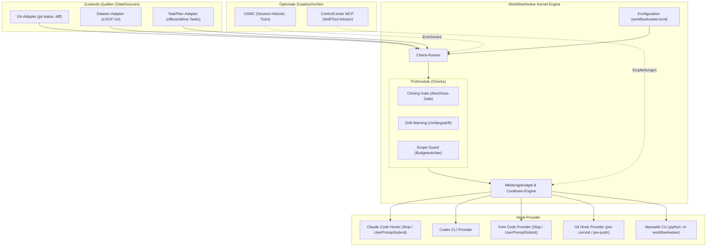
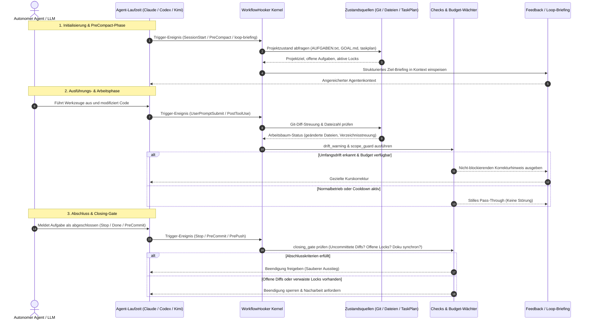

# WorkflowHooker (Deutsche Dokumentation)

[](LICENSE)
[](pyproject.toml)
[](.github/workflows/ci.yml)
[](tests)
[](pyproject.toml)
[](SECURITY.md)
[](SECURITY.md)
[](https://github.com/ellmos-ai)
[](https://github.com/open-bricks)
[](ellmos-module.v2.json)
[](llms.txt)
[](README.md)

> [!NOTE]
> **KI/LLM-Integrationshinweis:** Dieses Repository ist nach dem `ellmos.module.v2`-Standard für autonome KI-Agenten strukturiert. Siehe [`llms.txt`](llms.txt) für maschinenlesbare Kontextdateien und [`ellmos-module.v2.json`](ellmos-module.v2.json) für das Modulmanifest.
> Englische Haupt-Dokumentation: [`README.md`](README.md) • Sicherheitsrichtlinie: [`SECURITY.md`](SECURITY.md).

**Schnellnavigation:**
[Schnellstart](#schnellstart--installation) • [Architektur](#systemarchitektur) • [Workflow-Lebenszyklus](#agenten-workflow--closing-gate-lebenszyklus) • [Kernfunktionen](#kernfunktionen) • [Injektoren](#ziel--und-weck-injektoren) • [Sicherheitsrichtlinie](SECURITY.md) • [Geschwisterwerkzeuge](#ökosystem--geschwisterwerkzeuge) • [LLM-Kontext](llms.txt)

---

**Status: 0.2.1 — Arbeitsablaufsteuerung & Injektormuster.** (Last-checked: 2026-08-22)

WorkflowHooker bietet Hooks, die den **Arbeitsablauf** autonomer KI-Agenten steuern — nicht deren Wissen.

---

## Systemarchitektur



---

## Agenten-Workflow & Closing-Gate-Lebenszyklus



---

## Abgrenzung zu MemoryHooker

| | MemoryHooker | WorkflowHooker |
|---|---|---|
| Spielt ein | **Wissen** (was weiß ich schon?) | **Steuerung** (arbeite ich richtig?) |
| Quelle | Memory-Backend (Gardener, USMC, …) | Regeln, Checks, Projektzustand |
| Beispiel | „Zu diesem Modul gibt es 3 Erkenntnisse" | „Du hast 40 Dateien geändert und noch keinen Test laufen lassen" |

---

## Kernfunktionen

- **Abschluss-Gate (`closing_gate`):** Prüft vor dem Beenden, ob Steuerdateien nachgezogen, Locks entfernt und Diffs committet sind.
- **Drift-Warnung (`drift_warning`):** Warnt, wenn sich ein Agent über viele Ordner verzweigt oder vom Ziel abweicht.
- **Scope Guard (`scope_guard`):** Schutz vor unkontrollierten Großänderungen ohne Zwischenverifikation.
- **Frequenz-Budget & Cooldown:** Verhindert Spam-Feedback. Ein Hook spricht nur, wenn eine seltene Regel verletzt wird.
- **Auto-Deaktivierung:** Checks deaktivieren sich selbst, wenn das Fehlermuster nicht mehr auftritt (MetaFeedbackInjector-Muster).
- **Session-Hygiene (`session_hygiene`):** Optionale, nichtblockierende Hinweise zu Sessionstart/-ende, Quellenprüfung und passenden lokalen Werkzeugen.
- **Repository-Disziplin (`repository_discipline`):** Optionale Hinweise zu Fremdänderungs-Zertifizierung, Plan D, Bundle-Commits und der Push-Grenze.
- **Entscheidungssicherheit (`decision_safety`):** Optionale, geordnete Eskalations-, Dokumentations- und Review-Hinweise.
- **Orchestrierungssicherheit (`orchestration_safety`):** Optionale, signalgebundene Hinweise zu Delegation, Self-Healing-Handoffs und Modellökonomie.

---

## Schnellstart & Installation

```bash
# 1. Paket im Development-Modus installieren
pip install -e ".[dev]"

# 2. workflowhooker.toml Konfiguration erstellen
# Standardmäßig sind alle Checks deaktiviert ([mode] checks = ["closing_gate"])

# 3. CLI-Prüfung manuell testen
python -m workflowhooker check

# 4. Tests ausführen
python -m pytest
```

## Ziel- und Weck-Injektoren

Die Injektoren sind opt-in:

```toml
[injectors]
goal = true       # Ziel/Tasks beim PreCompact-Hook
loop = true       # lokales Weck-Briefing
session_hygiene = true  # budgetierte Sessionstart-/-ende-Hinweise
repository_discipline = true  # Git-/Plan-D-/Push-Policy-Hinweise
decision_safety = true  # Entscheidungseskalation/-dokumentation
orchestration_safety = true  # Orchestrierungs-/Modellökonomie-Hinweise

[repository_discipline]
certify_dirty_worktree = true
prefer_local_git_mirror = true
remind_push_policy = true

[decision_safety]
remind_escalation_chain = true
require_decision_basis = true
route_reviews_to_user = true

[orchestration_safety]
operator_guidance = true
filecommander_recovery = true
swarm_guidance = true
clutch_routing = true
expensive_model_guidance = true
fable5_savings = true
loop_goal_guidance = true
# Optionaler expliziter Laufzeitbeleg; nicht aus dem Provider erraten:
# model_context = "Fable 5"
expensive_model_markers = ["fable 5", "fable-5", "fable5"]
```

`goal` liest `AUFGABEN.txt` oder `GOAL.md` sowie projektbezogene offene und
aktive TASKPLAN-Tasks. `python -m workflowhooker loop-briefing --project-dir .`
erzeugt für lokale Runtimes ein deterministisches Briefing aus Ziel, Tasks,
Locks und uncommitteter Arbeit. WorkflowHooker stellt keinen Scheduler; den
Takt übernimmt Cron, eine Scheduled Task oder die Runtime.

### Session-Hygiene (opt-in, nur Hinweis)

`session_hygiene` nutzt den ersten `UserPromptSubmit` einer Sitzung als
portablen Starttrigger und `Stop` als Endtrigger. Der Starthinweis verweist auf
USMC-/Gardener-Kontext, die lokale Skill-Bibliothek sowie einen Quellen- und
Unsicherheits-Gegencheck. Prompt-Signale für Datum oder OneDrive ergänzen
einmalige Erinnerungen an `fc_get_time` beziehungsweise FileCommander-`fc_*`.
Jedes Thema erscheint höchstens einmal pro Sitzung und teilt sich das
vorhandene Meldungsbudget und den Cooldown.

Der Injector ist eine Arbeitshilfe, keine Ausführungsmaschine: Er fragt
Gardener nicht ab, schreibt keinen USMC-State, greift nicht auf OneDrive zu und
speichert keinen Prompttext. Selbst bei `Stop --block` bleibt er
nichtblockierend; nur ein echter Check-Befund darf den vorhandenen
Blockier-Exitcode verwenden. MemoryHooker bleibt für Wissensabruf zuständig.

### Repository-Disziplin (opt-in, nur Hinweis)

`repository_discipline` liest am `UserPromptSubmit` ausschließlich den
aktuellen Git-Zustand und den Projektpfad. Ein schmutziger Arbeitsbaum wird
konservativ behandelt: Git beweist keine Urheberschaft, daher benötigen
vorbestehende oder unzugeordnete Deltas einen Handoff mit Diff-Review, nativen
Tests, Secret-Signaturscan und Funktionsproben. Nur ausdrücklich übernommene
Änderungen gehören in einen kohärenten Bundle-Commit; der Injector committet
niemals fremde Änderungen.

Für einen Projektpfad unter OneDrive empfiehlt der optionale Plan-D-Hinweis
einen lokalen Git-/Build-Spiegel, das Git-Remote als Sync-Hub und nur einen
neutralen Pointer in OneDrive. Ein eigener Policy-Hinweis unterscheidet direkte
Nutzeraufträge zur konkreten Änderung, die Commit plus Push implizieren können,
von autonomen Läufen, die eine ausdrückliche schriftliche Push-Freigabe
benötigen. WorkflowHooker klont, verschiebt, committet und pusht nie; Push ist
keine Gate-Bedingung.

Das `closing_gate` bleibt objektiv: Nur ein schmutziger Git-Stand ergänzt die
präzise Ein-Bundle-Commit-Erinnerung, und im Hook-Pfad läuft das Gate nur am
`Stop`-Event. Ein sauberer Stand oder ein reiner Lock-Befund erhält keinen
Commit-Hinweis; der manuelle Befehl `workflowhooker check` bleibt verfügbar.

### Entscheidungssicherheit (opt-in, nur Hinweis)

`decision_safety` reagiert am `UserPromptSubmit` nur auf enge Entscheidungs-
oder Entscheidungsreview-Signale. Die vorgeschriebene Reihenfolge bleibt
erhalten: projektbezogene `DECISIONS.md` und Policies; zentrale `_DECISIONS`-/
TO-DECIDE-Bestände plus `SYSTEM-MANIFEST`; Gardener und USMC; TOM-lm; erst
danach der Nutzer, wenn Unsicherheit verbleibt. Der Hinweis behauptet nie,
dass eine Quelle bereits geprüft wurde.

Eine Entscheidungsdokumentation soll außerdem Basis, Belege und Quellen,
betrachtete Alternativen, aktuellen Faktenstand und verbleibende
Unsicherheiten enthalten. Ein Review oder eine Bewertung einer bestehenden
Entscheidung gilt als neue Nutzerentscheidung und wird zur `_DECISIONS`-/
`TO-DECIDE-USER`-Kette geroutet – niemals still verbucht oder als Policy
adoptiert. Die drei Hinweiskomponenten sind separat abschaltbar; der Injector
liest und schreibt keines der genannten Systeme.

### Orchestrierungssicherheit (opt-in, nur Hinweis)

`orchestration_safety` reagiert am `UserPromptSubmit` nur auf enge Signale zur
Aufgabenform oder zu einem Ausfall. Der Injector kann eine Aufteilung zwischen
Operator und Worker, einen Swarm für unabhängige gleichförmige Bulk-Arbeit,
providerneutrales clutch-Routing oder einen Taskplan-/Runtime-Loop und den
Goal-Modus mit explizitem Stopkriterium vorschlagen. Er startet oder delegiert
niemals Worker, Swarms, Loops oder Goals und wählt oder wechselt kein Modell.

Ein gemeldeter FileCommander-Ausfall gilt ausdrücklich als Fehler. Der Hinweis
übergibt Prüfungen von Registrierung/Config, Transport-Handshake,
npm-Consumer-Auflösung/-Start und eine kleine `fc_get_time`-Funktionsprobe an
einen autorisierten Reparatur-Worker; WorkflowHooker repariert nichts und
startet keinen MCP-Server.

Kosten- und Fable-Hinweise benötigen eine explizite Modellidentität aus dem
Hook-Payload oder der bewusst gesetzten Config. Konfigurierte Marker für teure
Modelle empfehlen Operator- oder fokussierten Eine-Aufgabe-Modus und sind eine
lokale Klassifikation, kein Live-Preisclaim. Nur expliziter Fable-5-Kontext
ergänzt den dokumentierten Vertrag: Opus 4.8 bleibt Hauptmodell/Worker, Fable 5
nur Advisor. Ist dieses Modell oder der Vertrag nicht belegt verfügbar, gibt
es keinen Wechsel- oder Einsparungsclaim. Alle Topics teilen Meldungsbudget,
Cooldown und sitzungsbezogene Deduplizierung und sind einzeln abschaltbar.

Die Anforderungen 1–24 aus T-20260731-05 sind durch getestete opt-in Hinweise
oder bestehende objektive Checks abgedeckt. Abdeckung bedeutet nicht, dass ein
externes System automatisch ausgeführt oder repariert wird.

## Ökosystem & Geschwisterwerkzeuge

WorkflowHooker ist ein integraler Baustein der `ellmos-ai`-Agenteninfrastruktur sowie des übergreifenden `open-bricks`-Ökosystems:

| Werkzeug / Repository | Kategorie | Rolle & Zweck |
|---|---|---|
| **[WorkflowHooker](https://github.com/ellmos-ai/workflowhooker)** | `ellmos-ai` / Orchestrierung | Steuerung des Agenten-Arbeitsablaufs, Abschluss-Gates, Drift-Warnungen & Weck-Injektoren |
| **[MemoryHooker](https://github.com/ellmos-ai/memoryhooker)** | `ellmos-ai` / Kontext | Persistente Wissenseinspeisung und Faktenabruf für Agentensitzungen |
| **[system-explorer](https://github.com/ellmos-ai/system-explorer)** | `ellmos-ai` / Diagnose | Multi-Agenten-Systemtopologie, Flotteninspektion & transaktionale Receipts |
| **[policy-registry](https://github.com/ellmos-ai/policy-registry)** | `ellmos-ai` / Governance | Deklarative Zugriffssteuerung, Schema-Validierung & Richtliniendurchsetzung |
| **[ellmos-delegation-authority](https://github.com/ellmos-ai/ellmos-delegation-authority)** | `ellmos-ai` / Delegation | Token-basiertes Berechtigungs- und Delegationsframework für Agenten |
| **[sqlite-transit-sync](https://github.com/ellmos-ai/sqlite-transit-sync)** | `ellmos-ai` / Storage | Hochzuverlässige SQLite-Transaktionsreplikation über Host-Knoten hinweg |
| **[lock-master](https://github.com/ellmos-ai/lock-master)** | `ellmos-ai` / Nebenläufigkeit | Null-Abhängigkeiten Datei-Sperren, Mutexes & Konfliktauflösung |
| **[system-gap-master](https://github.com/ellmos-ai/system-gap-master)** | `ellmos-ai` / Synchronisation | Multi-Host Synchronisation, Gatekeeper & Konfliktkopien-Reconciler |
| **[open-compute-mcp](https://github.com/ellmos-ai/open-compute-mcp)** | `ellmos-ai` / Automation | Open Compute MCP-Server für Desktop-Automation und Operator Ceilings |
| **[ellmos-filecommander-mcp](https://github.com/ellmos-ai/ellmos-filecommander-mcp)** | `ellmos-ai` / MCP | Leistungsfähiger Dateisystem- und Prozess-MCP-Server (47 Werkzeuge) |
| **[ellmos-codecommander-mcp](https://github.com/ellmos-ai/ellmos-codecommander-mcp)** | `ellmos-ai` / MCP | AST Code-Analyse-, Refactoring- und Linting-MCP-Server |
| **[ellmos-controlcenter-mcp](https://github.com/ellmos-ai/ellmos-controlcenter-mcp)** | `ellmos-ai` / MCP | MCP-Steuerungsebene, Bundle-Vorschläge & semantischer Skill-Router |
| **[n8n-manager-mcp](https://github.com/ellmos-ai/n8n-manager-mcp)** | `ellmos-ai` / Workflow | Sichere n8n-Workflow-Verwaltung, Node-Inspektion und Deployment |
| **[automation-master](https://github.com/dev-bricks/automation-master)** | `dev-bricks` / Automation | Multi-Agenten-Taskqueue, Lease-Koordination und Lock-Orchestrierung |
| **[DevCenter](https://github.com/dev-bricks/DevCenter)** | `dev-bricks` / Workspace | Zentrale Entwickler-Workbench und lokale Workspace-Verwaltung |
| **[CodeBox](https://github.com/dev-bricks/CodeBox)** | `dev-bricks` / Entwicklung | Isolierte Code-Ausführung, Plugin-Laufzeitumgebung und Dev-Tooling |
| **[MethodenAnalyser](https://github.com/dev-bricks/MethodenAnalyser)** | `dev-bricks` / Analyse | Automatisierte Methoden-Analyse, zyklomatische Komplexität & Metriken |
| **[open-bricks](https://github.com/open-bricks)** | `open-bricks` / Umbrella | Dachorganisation für modulare, interoperable Entwicklungs- und Desktop-Tools |

---

## Lizenz

MIT License — Copyright (c) 2026 ellmos-ai
