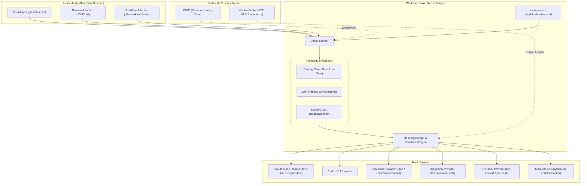
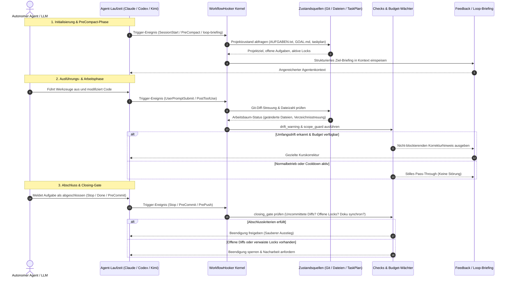

# WorkflowHooker (Deutsche Dokumentation)

[](LICENSE)
[](pyproject.toml)
[](.github/workflows/ci.yml)
[](tests)
[](pyproject.toml)
[](SECURITY.md)
[](SECURITY.md)
[](https://github.com/ellmos-ai)
[](https://github.com/open-bricks)
[](ellmos-module.v2.json)
[](llms.txt)
[](README.md)

> [!NOTE]
> **KI/LLM-Integrationshinweis:** Dieses Repository ist nach dem `ellmos.module.v2`-Standard für autonome KI-Agenten strukturiert. Siehe [`llms.txt`](llms.txt) für maschinenlesbare Kontextdateien und [`ellmos-module.v2.json`](ellmos-module.v2.json) für das Modulmanifest.
> Englische Haupt-Dokumentation: [`README.md`](README.md) • Sicherheitsrichtlinie: [`SECURITY.md`](SECURITY.md).

**Schnellnavigation:**
[Schnellstart](#schnellstart--installation) • [Architektur](#systemarchitektur) • [Workflow-Lebenszyklus](#agenten-workflow--closing-gate-lebenszyklus) • [Kernfähigkeiten](#kernfähigkeiten--sicherheitsinvarianten) • [Injektoren](#ziel--und-weck-injektoren) • [Sicherheitsrichtlinie](SECURITY.md) • [Geschwisterwerkzeuge](#ökosystem--geschwisterwerkzeuge) • [LLM-Kontext](llms.txt)

---

**Status: 0.2.3 — Arbeitsablaufsteuerung & Injektormuster.** (Last-checked: 2026-08-24)

WorkflowHooker bietet Hooks, die den **Arbeitsablauf** autonomer KI-Agenten steuern — nicht deren Wissen.

---

## Systemarchitektur



---

## Agenten-Workflow & Closing-Gate-Lebenszyklus



---

## Kernfähigkeiten & Sicherheitsinvarianten

| Invariante / Fähigkeit | Garantie | Technische Umsetzung |
|---|---|---|
| **100% Local-First & Zero-Egress** | Vollständiger Offline-Datenschutz | Keine Netzwerkaufrufe, keine Telemetrie, keine externen API-Zugriffe. Alle Prüfungen erfolgen rein auf lokalen Dateien, Git und Prozessumgebung. |
| **Standardmäßig rein lesend** | Nebenwirkungsfreie Prüfungen | Alle Check-Runner (`closing_gate`, `drift_warning`, `scope_guard`) und Zustandsadapter arbeiten strikt im Nur-Lese-Modus ohne Repository-Mutation. |
| **Unprivilegierter User-Mode** | Non-Elevation Prinzip | Funktioniert vollständig im Standard-Benutzerkonto ohne Root- oder Administrator-Rechte. |
| **Meldungsbudget & Anti-Spam** | Max. 3 Meldungen / Session | Konfigurierbare Meldungsobergrenzen und Cooldown-Timer verhindern Kontextüberlastung und Prompt-Dauerfeuer. |
| **Deterministisches Closing-Gate** | Verlässliche Arbeitsabnahme | Verhindert vorzeitige Beendigung bei uncommitteten Diffs, verwaisten `LOCK*.txt`-Sperren oder offenen Aufgaben. |
| **Ziel- & Loop-Injektoren** | PreCompact & Weck-Briefings | Speist Projektziele aus `AUFGABEN.txt`/`GOAL.md` und TASKPLAN-Tasks bei PreCompact und periodischen Weckzyklen in den Agentenkontext ein. |
| **Laufzeitunabhängige Provider** | Plattformunabhängige Hooks | Modulare Provider-Architektur für Claude Code (`Stop`, `UserPromptSubmit`, `PreCompact`), Codex CLI, Kimi Code und manuelle CLI. |
| **Zero Runtime Dependencies** | Maximale Portabilität | Keine externen Python-Laufzeitabhängigkeiten (reine Standardbibliothek; `pytest` und `ruff` nur für Entwicklung). |

---

## Abgrenzung zu MemoryHooker

| | MemoryHooker | WorkflowHooker |
|---|---|---|
| Spielt ein | **Wissen** (was weiß ich schon?) | **Steuerung** (arbeite ich richtig?) |
| Quelle | Memory-Backend (Gardener, USMC, …) | Regeln, Checks, Projektzustand |
| Beispiel | „Zu diesem Modul gibt es 3 Erkenntnisse" | „Du hast 40 Dateien geändert und noch keinen Test laufen lassen" |

---

## Kernfunktionen

- **Abschluss-Gate (`closing_gate`):** Prüft vor dem Beenden, ob Steuerdateien nachgezogen, Locks entfernt und Diffs committet sind.
- **Drift-Warnung (`drift_warning`):** Warnt, wenn sich ein Agent über viele Ordner verzweigt oder vom Ziel abweicht.
- **Scope Guard (`scope_guard`):** Schutz vor unkontrollierten Großänderungen ohne Zwischenverifikation.
- **Frequenz-Budget & Cooldown:** Verhindert Spam-Feedback. Ein Hook spricht nur, wenn eine seltene Regel verletzt wird.
- **Auto-Deaktivierung:** Checks deaktivieren sich selbst, wenn das Fehlermuster nicht mehr auftritt (MetaFeedbackInjector-Muster).

---

## Schnellstart & Installation

1. `pip install -e ".[dev]"` im Repo-Klon (zero-dependency zur Laufzeit; `pytest` nur für die Testsuite).
2. `workflowhooker.toml` anlegen und **explizit** die gewünschten Checks eintragen (`[mode] checks = ["closing_gate"]`).
3. Manuell ausführen: `python -m workflowhooker check` (prüft Projektordner + Git-Status des Arbeitsverzeichnisses).
4. Claude-Code-Hook generieren: `python -m workflowhooker install-snippet --out snippet.json` erzeugt den `Stop`/`PreCompact`/`UserPromptSubmit`-Block.
5. Codex-Hook generieren: `python -m workflowhooker install-snippet --provider codex --out snippet.json`.

---

## Kandidaten-Sammler fuer Skill-/Workflow-Extraktion (opt-in)

Trennt den LEICHTEN Live-Hook vom TEUREN Extraktionsschritt: `candidate-collect <Stop|SessionEnd> --provider <name>` schreibt hoechstens EIN redigiertes Envelope (Zeiger, keine Transkriptinhalte) pro Sitzung — stumm, idempotent, fail-open, nur bei `[candidates] enabled = true` aktiv. `candidate-extract [--clear]` ist der rein lesende Offline-Schritt und verweist auf `skill-extractor`/`workflow-extract` als eigentliche Ausfuehrende. Aktivierung bleibt manuell und opt-in je Akteur (kein automatisches Eintragen in `settings.json`/`hooks.json`). Details: `README.md`, Abschnitt "Kandidaten-Sammler fuer Skill-/Workflow-Extraktion".

---

## Ziel- und Weck-Injektoren

In `workflowhooker.toml` aktivieren:

```toml
[injectors]
goal = true       # Ziel/Tasks beim PreCompact-Hook injizieren
loop = true       # loop-briefing als lokale Runtime-Schnittstelle freigeben
```

Für lokale Modelle liefert `python -m workflowhooker loop-briefing --project-dir .` ein deterministisches Briefing aus Ziel, offenen Tasks, Locks und uncommitteter Arbeit.

---

## Ökosystem & Geschwisterwerkzeuge

WorkflowHooker ist Teil der `ellmos-ai`-Infrastruktur und des `open-bricks`-Ökosystems:

| Werkzeug / Repository | Kategorie | Rolle & Zweck |
|---|---|---|
| **[WorkflowHooker](https://github.com/ellmos-ai/workflowhooker)** | `ellmos-ai` / Orchestrierung | Agenten-Prozesssteuerung, Abschluss-Gates, Drift-Warnungen & Weck-Injektoren |
| **[MemoryHooker](https://github.com/ellmos-ai/memoryhooker)** | `ellmos-ai` / Kontext | Persistente Wissensinjektion und Kontextanreicherung für KI-Sitzungen |
| **[system-explorer](https://github.com/ellmos-ai/system-explorer)** | `ellmos-ai` / Diagnose | Multi-Agenten-Systeminspektion, Topologieanalyse & Runtime-Quittungen |
| **[policy-registry](https://github.com/ellmos-ai/policy-registry)** | `ellmos-ai` / Governance | Deklarative Zugriffskontrolle, Schemavalidierung & Sicherheitsrichtlinien |
| **[ellmos-delegation-authority](https://github.com/ellmos-ai/ellmos-delegation-authority)** | `ellmos-ai` / Delegation | Multi-Agenten-Token-Autorität & fähigkeitsbasierte Delegation |
| **[sqlite-transit-sync](https://github.com/ellmos-ai/sqlite-transit-sync)** | `ellmos-ai` / Speicherung | Transaktionale SQLite-Zustandsreplikation über Host-Knoten |
| **[lock-master](https://github.com/ellmos-ai/lock-master)** | `ellmos-ai` / Nebenläufigkeit | Zero-Dependency Dateisperren, Mutexe & Konfliktauflösung |
| **[system-gap-master](https://github.com/ellmos-ai/system-gap-master)** | `ellmos-ai` / Synchronisation | Verteilte Multi-Host-Synchronisation & Konfliktkopien-Bereinigung |
| **[open-compute-mcp](https://github.com/ellmos-ai/open-compute-mcp)** | `ellmos-ai` / Automatisierung | Open Compute MCP-Server für Desktop-Betriebssystem-Automatisierung |
| **[ellmos-filecommander-mcp](https://github.com/ellmos-ai/ellmos-filecommander-mcp)** | `ellmos-ai` / MCP | Hochperformante Dateisystem- und Prozessverwaltungs-Werkzeuge (47 Tools) |
| **[ellmos-codecommander-mcp](https://github.com/ellmos-ai/ellmos-codecommander-mcp)** | `ellmos-ai` / MCP | Code-Analyse, AST-Refactoring und Python-Linter MCP-Server |
| **[ellmos-controlcenter-mcp](https://github.com/ellmos-ai/ellmos-controlcenter-mcp)** | `ellmos-ai` / MCP | MCP-Steuerungsebene, Bundle-Vorschläge & semantischer Skill-Router |
| **[n8n-manager-mcp](https://github.com/ellmos-ai/n8n-manager-mcp)** | `ellmos-ai` / Workflow | Sichere n8n-Workflow-Verwaltung, Node-Inspektion und Deployment |
| **[automation-master](https://github.com/dev-bricks/automation-master)** | `dev-bricks` / Automatisierung | Multi-Agenten-Aufgabenwarteschlange, Lease-Koordinator & Sperrorchestrierung |
| **[DevCenter](https://github.com/dev-bricks/DevCenter)** | `dev-bricks` / Entwickler | Einheitliche lokale Entwickler-Werkbank und Workspace-Orchestrierung |
| **[CodeBox](https://github.com/dev-bricks/CodeBox)** | `dev-bricks` / Entwicklung | Isolierte Code-Ausführung, Plugin-Laufzeit und Entwicklungs-Sandbox |
| **[MethodenAnalyser](https://github.com/dev-bricks/MethodenAnalyser)** | `dev-bricks` / Analyse | Automatisierte Methoden-Analyse, zyklomatische Komplexität & Metriken |
| **[open-bricks](https://github.com/open-bricks)** | `open-bricks` / Dachverband | Offene Architektur für Werkzeuge, Desktop-Software und KI-Agenten |

---

## Lizenz

MIT License — Copyright (c) 2026 ellmos-ai
